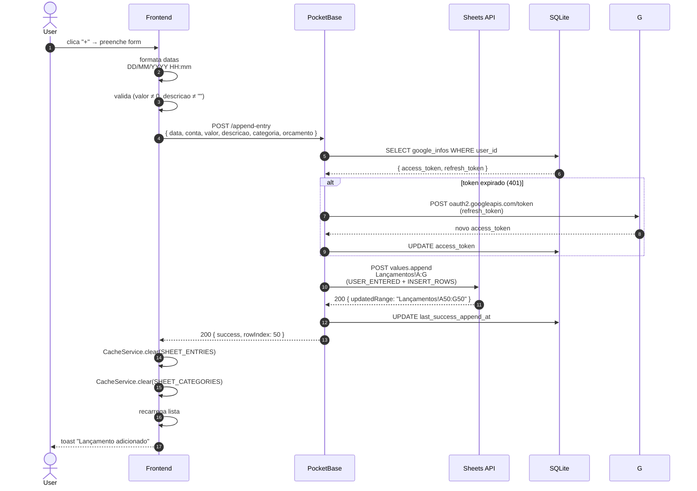
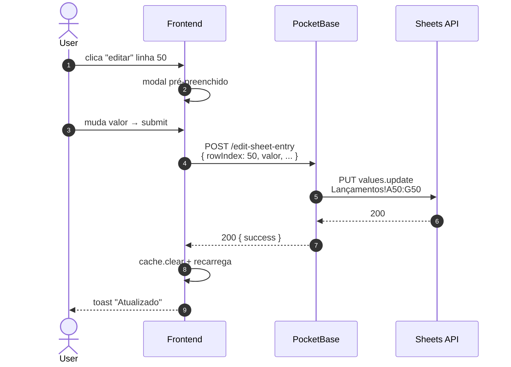

# PRD-003 — Lançamentos Financeiros (CRUD)

## Contexto

A "feature central" do app. Um **lançamento** é uma linha na aba
`Lançamentos` da planilha, representando uma receita ou despesa com:

| Col | Campo | Exemplo | Notas |
|---|---|---|---|
| A | data | `01/11/2025 14:30` | Data e hora do lançamento |
| B | conta | `Banco do Brasil` | Nome livre da conta |
| C | valor | `-150.50` | Positivo = receita, negativo = despesa |
| D | descricao | `Supermercado Pão de Açúcar` | Texto livre, max 255 chars |
| E | categoria | `Alimentação` | Deve existir na aba Categorias |
| F | orcamento | `30/11/2025` | Só data (sem hora) |
| G | observacao | `Compra da semana` | Opcional |

Este PRD cobre o CRUD: criar, listar, editar, deletar. Edge cases
especiais (futuro, transferência) estão em PRDs separados.

## Objetivos

- Criar lançamento com validação no client e no backend
- Listar lançamentos paginados e ordenáveis
- Editar lançamento existente
- Deletar lançamento com confirmação
- Garantir que o cache local (PRD-007-categorias.md é outro, mas o cache
  de entries tá aqui) é invalidado após qualquer mutation
- Propagar erros de forma clara (toast em PT-BR)

## Não-objetivos

- Lançamentos em lote (multi-linha) — fora do escopo
- Importar extrato bancário (OFX/CSV) — futuro
- Anexar comprovante/foto direto na planilha (fotos vão via OCR, PRD-011)
- Lançamentos recorrentes automáticos (tipo "todo dia 5 paga X")

## Personas

- **Usuário autenticado com planilha** (PRD-002 completo) — usa no
  dia a dia pra registrar gastos

## User Stories

### US-3.1 — Criar lançamento

**Como** usuário,
**quero** adicionar um gasto/receita preenchendo data, conta, valor,
descrição, categoria e orçamento,
**para** registrar minha movimentação financeira.

**Critérios de aceite:**
- [ ] Form valida campos obrigatórios: valor (≠ 0), descrição (≠ vazio)
- [ ] Data default: agora (`new Date()`)
- [ ] Orçamento default: fim do mês corrente
- [ ] Conta: select com contas já usadas + opção "nova conta"
- [ ] Categoria: select com categorias da aba Categorias
- [ ] Submeter: formata datas pra `DD/MM/YYYY HH:mm` e `DD/MM/YYYY`
      e envia `POST /append-entry`
- [ ] Backend usa `values.append` (atômico, sem race condition)
- [ ] Sucesso: cache invalidado, lista recarregada, toast "Lançamento
      adicionado"
- [ ] Erro: toast com mensagem do backend, form mantém valores

### US-3.2 — Listar lançamentos

**Como** usuário,
**quero** ver todos os meus lançamentos em ordem cronológica,
**para** conferir o que entrou e saiu.

**Critérios de aceite:**
- [ ] Default: 100 lançamentos mais recentes
- [ ] Ordenação: data decrescente (mais recente primeiro)
- [ ] Botão "Carregar mais" pra paginação
- [ ] Botão "Recarregar" força bypass do cache
- [ ] Skeleton/loading enquanto carrega
- [ ] Estado vazio: mensagem amigável ("Nenhum lançamento ainda.
      Adicione o primeiro!")
- [ ] Datas exibidas em formato BR (`DD/MM/YYYY HH:mm`) — backend
      devolve Excel Serial, frontend converte

### US-3.3 — Editar lançamento

**Como** usuário,
**quero** corrigir um lançamento que errei,
**para** manter meus dados corretos.

**Critérios de aceite:**
- [ ] Click no lançamento abre modal de edição pré-preenchido
- [ ] Mesma validação do create
- [ ] Salvar: `POST /edit-sheet-entry` com `rowIndex` + payload
- [ ] Hook usa `values.update` na linha exata (`A{row}:G{row}`)
- [ ] Cache invalidado, lista recarregada
- [ ] Toast "Lançamento atualizado"

### US-3.4 — Deletar lançamento

**Como** usuário,
**quero** apagar um lançamento errado ou duplicado,
**para** manter a planilha limpa.

**Critérios de aceite:**
- [ ] Click no botão deletar abre modal de confirmação
- [ ] Confirmar: `POST /delete-sheet-entry` com `rowIndex`
- [ ] Hook usa `values.clear` em `A{row}:G{row}` (não deleta a linha
      inteira pra não bagunçar a ordem — fica célula vazia)
- [ ] OU hook deleta a linha mesmo (decisão de implementação —
      verificar no código atual)
- [ ] Cache invalidado, lista recarregada
- [ ] Toast "Lançamento deletado"

## Fluxo de uso

### Criar
```
User no dashboard ou PWA
  → clica "+" (FAB) ou botão "Adicionar"
  → modal de lançamento abre
  → preenche campos
  → submit
  → frontend formata datas (DD/MM/YYYY HH:mm)
  → POST /append-entry
  → hook valida → pega google_infos → gsheets.callWithRefresh()
  → values.append em Lançamentos!A:G
  → retorna { success, rowIndex }
  → frontend: cache.clear(SHEET_ENTRIES)
  → cache.clear(SHEET_CATEGORIES) (pq pode ter mudado lista de contas)
  → recarrega lista
  → fecha modal, mostra toast
```

### Editar
```
User na lista → clica no ícone de editar
  → modal abre com valores do lançamento selecionado
  → user edita campos
  → submit
  → POST /edit-sheet-entry { rowIndex, data, conta, valor, ... }
  → hook values.update em A{row}:G{row}
  → cache invalidado, lista recarregada
```

### Deletar
```
User na lista → clica no ícone de deletar
  → modal "Tem certeza?"
  → confirma
  → POST /delete-sheet-entry { rowIndex }
  → hook deleta linha (ou limpa células)
  → cache invalidado, lista recarregada
```

## Diagrama de sequência

### Criar lançamento



### Editar / Deletar (mesmo formato, endpoints diferentes)



**Atores:** User, Frontend, PB, Sheets API, SQLite (mesmo padrão do PRD-002).

**Highlights:**
- `values.append` é **atômico** (sem race condition de GET+PUT)
- Refresh automático de token **dentro do handler** (helper `callWithRefresh`)
- Cache invalidado **client-side** após mutation (TTL 5min, vide `services/cache.ts`)
- `rowIndex` extraído do `updatedRange` retornado pelo Sheets (ex: `Lançamentos!A50:G50` → `50`)
- Datas enviadas como **string BR** (`DD/MM/YYYY HH:mm`); Sheets converte pra serial Excel com `USER_ENTERED`

- **Duplicidade por retry**: se o user clica submit 2x, o primeiro
  sucesso invalida o cache, mas o segundo POST cria duplicata.
  Solução: desabilitar botão durante submit + ID local de "submit em
  andamento".
- **Lançamento deletado enquanto edita**: user A edita, user B deleta
  (outro device), user A salva → 404 ou erro. Frontend precisa
  mostrar "esse lançamento não existe mais".
- **Planilha com 10k+ linhas**: `values.get` em range grande é
  lento. Cache de 5min ajuda, mas o user pode esperar. Solução
  futura: paginação server-side (hoje é client-side).
- **Categoria deletada da aba Categorias**: lançamento antigo
  continua com categoria orfã. Hoje sistema aceita (não valida
  no append). Decisão: validar ou aceitar? MVP aceita.
- **Valor zero**: validado (não aceita). Mas 0.01 é OK.
- **Valor muito grande**: hoje sem limite. Risco: bug de digitação
  "100000" em vez de "100". Validação futura: faixa razoável.
- **Conta com caracteres especiais**: aceita (texto livre), mas
  pode quebrar sorting alfabético. Decisão: validar/normalizar.
- **Descrição com 256+ chars**: backend trunca? Validar?
  Decisão: max 255 (PRD diz isso), frontend trunca.

## Requisitos técnicos

- Hooks: `append-entry.pb.js`, `edit-sheet-entry.pb.js`,
  `delete-sheet-entry.pb.js`, `get-sheet-entries.pb.js`
- Helper `_google-sheets-helper.js` com `callWithRefresh()`,
  `buildAppendUrl()`, `parseRowIndexFromRange()`
- Datas: backend devolve serial, frontend converte com
  `excelSerialToDate()` (helpers em `src/utils/date-helpers.ts`)
- Cache: TTL 5min, chaves `ehtudoplanilha:sheet-entries` e
  `ehtudoplanilha:sheet-categories`
- Invalidação: `CacheService.clear()` após cada mutation

## Métricas de sucesso

- **Tempo médio de criação** — do clique "+" até toast de sucesso
  (meta: <3s em rede normal)
- **Taxa de erro no append** — % de submits que falham (meta: <2%)
- **Taxa de uso do cache** — quantos reloads da lista vêm do cache
  vs API (meta: >60% em uso normal)
- **Lançamentos por usuário/semana** — engajamento (baseline a definir)

## Notas / Pendências

- `values.append` é **atômico** (sem race condition de GET+PUT) — bom
- `delete-sheet-entry` hoje provavelmente **deleta a linha** inteira
  (verificar comportamento atual — pode ser `clear` da linha)
- Não há **bulk delete** nem **bulk edit** — futuro
- Não há **filtros salvos** ("sempre ver só Alimentação") — futuro
