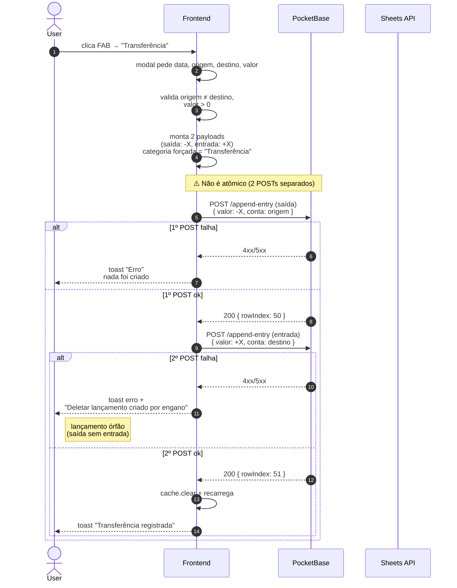

# PRD-005 — Transferência entre Contas

## Contexto

Usuário tem **múltiplas contas** (Carteira, Banco, Nubank, etc.) e
precisa **mover dinheiro entre elas** (ex: saquei dinheiro do banco
e coloquei na carteira; ou transferi do Banco pro Nubank).

A transferência **não é receita nem despesa** — o saldo total não
muda. Mas a planilha precisa registrar 2 movimentos: **saída** da
conta origem e **entrada** na conta destino.

## Objetivos

- Criar dois lançamentos atômicos: débito na origem, crédito no destino
- Garantir que se um falha, o outro **não acontece** (atomicidade
  pela perspectiva do user — não transação SQL, mas UX)
- Marcar ambos como "Transferência" (categoria especial) pra
  relatórios poderem excluir
- Descrição padronizada: `Transferência: [origem] → [destino]`

## Não-objetivos

- Transferência entre **users** diferentes (split com amigo) — fora
- Agendamento de transferência (todo dia X) — fora
- Integração direta com banco (PIX) — fora

## Personas

- **Usuário autenticado com planilha** — usa pra mover entre contas

## User Stories

### US-5.1 — Criar transferência

**Como** usuário com 2+ contas,
** quero** transferir X reais da conta A pra conta B,
** para** refletir o movimento na planilha sem distorcer o total.

**Critérios de aceite:**
- [ ] Botão dedicado "Transferência" no FAB (separado de Lançamento)
- [ ] Modal pede: data, conta origem, conta destino, valor, descrição,
      categoria = "Transferência" (forçado), orçamento
- [ ] Valor é **sempre positivo** (input único)
- [ ] Conta origem ≠ conta destino (validado)
- [ ] Submeter: frontend faz **DOIS POSTs** sequenciais em `/append-entry`:
  - Lançamento 1 (saída): `valor: -X, conta: origem, descricao: "Transferência: A → B"`
  - Lançamento 2 (entrada): `valor: +X, conta: destino, descricao: "Transferência: A → B"`
- [ ] Mesma data, mesma categoria, mesmo orçamento nos dois
- [ ] Se o 1º POST falhar, o 2º **não** é feito
- [ ] Se o 1º OK e o 2º falha: user é avisado que tem lançamento
      órfão, e dado opção de deletar manualmente
- [ ] Cache invalidado após ambos (ou após o sucesso parcial)

### US-5.2 — Excluir transferências de relatórios

**Como** usuário,
** quero** que relatórios de despesa/receita não contabilizem
 transferências,
** para** ver meu gasto real, não o "ruído" das transferências.

**Critérios de aceite:**
- [ ] Categoria "Transferência" tem flag que marca como
      "excluir de relatórios"
- [ ] Resumo financeiro (PRD-007) filtra essa categoria
- [ ] User pode mudar a categoria de uma transferência (e aí ela
      conta normal)

## Fluxo de uso

### Criar
```
User no dashboard/PWA → FAB → "Transferência"
  → modal abre
  → preenche data, conta origem, conta destino, valor, descrição (opcional)
  → categoria: travada em "Transferência" (select desabilitado)
  → orçamento: default = dia 1 do próximo mês
  → submit
  → frontend monta 2 payloads
  → POST /append-entry (saída) → se falhar, mostra erro
  → POST /append-entry (entrada) → se falhar, mostra aviso e link
     "deletar lançamento anterior"
  → sucesso total
  → cache invalidado, lista recarregada
  → toast: "Transferência registrada"
```

### Cancelar
```
User abre modal e fecha sem submit
  → nada acontece, sem confirmação (mudanças não persistem)
```

## Diagrama de sequência



**Atores:** User, Frontend, PB, Sheets API.

**Highlights:**
- **NÃO há endpoint `/append-transfer` único** — são 2 POSTs em `/append-entry`
- A "atomicidade" é só **na UX** (frontend trata 2º como opcional se 1º falhou)
- O caso de **órfão** (1º ok, 2º falha) deixa um lançamento "saída" sem "entrada" correspondente — o saldo fica distorcido
- Trade-off documentado: **simplicidade vs garantia real**. Atomicidade real exigiria transação no hook
- Categoria `"Transferência"` é **fixa** (select desabilitado no modal) — usada pra excluir de relatórios

- **Origem = destino**: erro de validação no client (nem chega no
  backend).
- **Valor zero ou negativo**: erro de validação.
- **Backend dá 500 no 1º POST**: user vê erro, **nada** foi criado.
  Pode tentar de novo. Idempotente na perspectiva do user.
- **Backend dá 500 no 2º POST** (após 1º OK): user vê aviso.
  **Lançamento órfão criado** (saída sem entrada correspondente).
  Decisão MVP: mostrar toast de erro e link "deletar lançamento
  criado por engano" que abre o delete direto da linha. **Não é
  atômico** mas é a melhor UX sem transaction real.
- **Conta origem/destino não existe na planilha**: aceito, vai
  criar o nome novo na coluna B. Cria "bagunça" mas funciona.
- **Conta destino digitada com typo**: vai pra planilha com typo.
  Sem deduplicação. (Validação futura: select com contas já usadas
  + warning se digitar nome novo.)
- **Transferência futura**: hoje, **não suportado**. Modal não
  permite data vazia. (Roadmap: separar "Transferência" de
  "Lançamento futuro" é complexo.)
- **Cache stale**: se user A transfere, user B (outro device) não
  vê até refresh. Aceito (cache 5min).

## Requisitos técnicos

- **Não usa endpoint novo** — reusa `POST /append-entry` 2x
- Atomicidade parcial: melhor esforço (try/catch no frontend)
- Frontend: componente `transfer-entry-modal.ts` (src) e lógica
  similar no PWA
- Categoria "Transferência" vem do `CATEGORIAS_PADRAO` no
  `provision-sheet.pb.js` (linha 58: `["Transferência", "TRANSFERÊNCIA"]`)
- Flag de "excluir de relatórios": hoje provavelmente **não tem**.
  Decisão MVP: filtrar hardcoded nos relatórios (`if categoria === 'Transferência'`).

## Métricas de sucesso

- **Volume de transferências/usuário/mês** — baseline a definir
- **Taxa de erro na criação** — % que falha em criar as duas (meta: <3%)
- **Taxa de "órfão"** — % em que só 1 das 2 foi criada (meta: <1%)

## Notas / Pendências

- **Atomicidade real** exigiria um endpoint novo `/append-transfer`
  que faz ambos os appends num único POST. Hoje é dois POSTs.
  Trade-off: simplicidade vs garantia. MVP escolheu simplicidade.
- **Flag "excluir de relatórios"** no schema de categorias não
  existe. Hoje o filtro é hardcoded por nome. Se user renomear
  "Transferência" pra "Transf", relatórios incluem.
- **Sem recorrência** (todo mês transfere X da conta A pra B).
- **Sem split** entre users diferentes.
