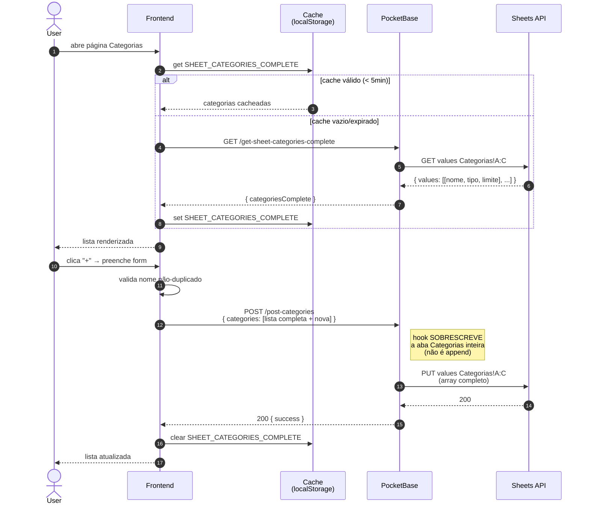

# PRD-006 — Categorias e Tipos

## Contexto

Cada lançamento tem uma **categoria** (Alimentação, Salário, Aluguel,
etc.). As categorias vivem na aba `Categorias` da planilha do user.

Cada categoria tem um **tipo** que classifica o que ela representa:

| Tipo | Significado | Exemplos |
|---|---|---|
| `RENDA` | Receita | Salário, 13º, Aluguel recebido |
| `PRECISO` | Despesa essencial | Aluguel, Supermercado, Luz |
| `QUERO` | Despesa supérflua | Delivery, Restaurantes, Viagens |
| `INVESTIMENTOS` | Aporte/investimento | Aposentadoria, CDB |
| `TRANSFERÊNCIA` | Movimentação interna | Transferência entre contas |
| `SALDO` | Saldo inicial da conta ou correção de saldo | "Saldo inicial Carteira 500", "Ajuste inventário Nubank" |

Categorias **PRECISO** podem ter um **limite mensal** (orçamento),
ex: `Supermercado: R$ 800/mês`. O agregado (PRD-007) compara
gasto real vs limite.

## Objetivos

- Fornecer lista padrão de 45+ categorias ao criar a planilha (PRD-002)
- Permitir usuário **adicionar** categoria nova
- Permitir usuário **editar** nome/tipo/limite de categoria existente
- Permitir usuário **deletar** categoria (com cuidado: lançamentos
  antigos referenciam o nome)
- Expor categorias pra autocomplete no form de lançamento
- Cache local pra evitar buscar toda hora
- **Permitir o usuário reordenar a ordem de display das categorias**
  (drag-and-drop ou setas de subir/descer). Hoje a ordem é alfabética.
  Vai exigir adicionar coluna `ordem` no schema da aba Categorias.

## Não-objetivos

- **Validação obrigatória** de categoria no append (hoje aceita qualquer
  string, mesmo que não exista na aba). Roadmap: validar.
- **Subcategorias** (Alimentação > Supermercado). Fora.
- **Importar/exportar** lista de categorias.

## ⚠️ Risco: categoria deletada

> Se o user **deleta** uma categoria que está em uso por lançamentos
> antigos, esses lançamentos ficam com **categoria órfã** (string que
> não bate com nenhuma linha da aba Categorias). O sistema **não**
> trata isso como erro — aceita a string — mas o autocomplete deixa
> de oferecer essa opção.
>
> MVP: confirmar antes de deletar categoria em uso.

## Personas

- **Usuário autenticado com planilha** — gerencia suas categorias

## User Stories

### US-6.1 — Ver categorias

**Como** usuário,
** quero** ver a lista das minhas categorias com tipo e limite,
** para** revisar o que tenho.

**Critérios de aceite:**
- [ ] Lista carrega de `GET /get-sheet-categories-complete`
- [ ] Exibe: nome, tipo (badge colorido), limite (se > 0)
- [ ] Cache: TTL 5min, chave `ehtudoplanilha:sheet-categories-complete`
- [ ] Loading state enquanto carrega
- [ ] Estado vazio: "Você ainda não tem categorias. Adicione a primeira."

### US-6.2 — Adicionar categoria

**Como** usuário,
** quero** adicionar uma categoria nova com nome, tipo e limite (opcional),
** para** classificar meus lançamentos.

**Critérios de aceite:**
- [ ] Form: nome (texto, obrigatório), tipo (select, obrigatório),
      limite (número, opcional, > 0)
- [ ] Validação: nome não pode duplicar categoria existente
- [ ] Submeter: `POST /post-categories` com array completo de categorias
      (endpoint sobrescreve a aba inteira — **não** é append)
- [ ] Sucesso: cache invalidado, lista recarregada
- [ ] Toast "Categoria adicionada"

### US-6.3 — Editar categoria

**Como** usuário,
** quero** mudar o nome, tipo ou limite de uma categoria,
** para** corrigir ou ajustar.

**Critérios de aceite:**
- [ ] Click no ícone de editar abre form pré-preenchido
- [ ] Mesma validação do add
- [ ] **Atenção**: mudar o nome de uma categoria **quebra a referência**
      em lançamentos antigos. Avisar: "Os lançamentos com a categoria
      antiga não serão atualizados automaticamente. Atualize-os
      manualmente se quiser."

### US-6.4 — Deletar categoria

**Como** usuário,
** quero** deletar uma categoria que não uso mais,
** para** limpar a lista.

**Critérios de aceite:**
- [ ] Click no ícone de deletar
- [ ] **Se categoria está em uso** (algum lançamento referencia):
      modal de confirmação forte: "Esta categoria está em N lançamentos.
      Deletar vai deixar esses lançamentos sem categoria reconhecida.
      Continuar?"
- [ ] Se não está em uso: confirmação simples
- [ ] Submeter: `POST /post-categories` sem a categoria
- [ ] Cache invalidado, lista recarregada

### US-6.5 — Autocomplete no form de lançamento

**Como** usuário,
** quero** digitar no campo categoria e ver sugestões,
** para** não ter que lembrar o nome exato.

**Critérios de aceite:**
- [ ] Input vira select com autocomplete ao focar
- [ ] Lista vem do cache (PRD-006 §US-6.1)
- [ ] Filtragem local por substring (case-insensitive)
- [ ] Permitir digitar valor novo (cria categoria "implícita" — vai
      pro append sem estar na aba)
- [ ] Após criar lançamento com categoria nova implícita, sugestão
      de "Adicionar [nome] à lista de categorias?"

## Fluxo de uso

### Add
```
User na página de categorias
  → clica "+ Categoria"
  → modal: nome, tipo, limite
  → submit
  → frontend faz GET da lista atual
  → adiciona a nova categoria
  → POST /post-categories com a lista completa atualizada
  → hook sobrescreve aba Categorias inteira
  → cache invalidated
  → lista recarregada
  → toast sucesso
```

### Delete
```
User na lista de categorias
  → clica no ícone deletar
  → modal: "Esta categoria está em N lançamentos..." (se aplicável)
  → confirma
  → mesma lógica: GET + remove + POST /post-categories
  → cache invalidated, recarrega
```

## Diagrama de sequência

### Adicionar categoria



**Atores:** User, Frontend, Cache local, PB, Sheets API.

**Highlights:**
- `POST /post-categories` **NÃO é append** — é sobrescrita completa da aba Categorias
- O frontend **busca a lista atual, adiciona/edita/remove a categoria, e envia a lista toda** de volta
- Cache invalidado após mutation (TTL 5min, vide `cache.ts`)
- Validação de duplicidade é **client-side** (compara com lista carregada)
- Categorias deletadas com lançamentos em uso: hoje o sistema **não atualiza retroativamente** os lançamentos (PRD-005 transferências continuam contando como "Transferência", mas se user renomear, param de contar)

- **User edita nome de categoria em uso**: lançamentos antigos
  continuam com nome antigo (string solta, sem referência).
  Avisar explicitamente. Roadmap: oferecer "atualizar todos os
  lançamentos com a nova categoria?".
- **User edita limite de PRECISO para um valor menor que o gasto
  atual do mês**: não impedir. Apenas mostra que estourou no
  agregado.
- **User cria categoria tipo SALDO**: é tipo **real e válido** —
  usado para o **saldo inicial da conta** (ex: "Saldo inicial Carteira
  R$ 500") ou **correção de saldo** (ex: "Ajuste inventário Nubank
  R$ 30"). Aparece nos agregados como receita ou despesa normal
  (depende do sinal do valor).
- **User cria categoria com tipo não previsto** (ex: "EXTRA"):
  aceito. Sistema não valida. Aparece no badge com cor padrão.
- **Limite 0 ou negativo**: erro de validação.
- **Limite 0 = sem limite**: convenção. Edita UI deve explicitar.

## Requisitos técnicos

- Hooks: `get-sheet-categories-complete.pb.js`,
  `post-categories.pb.js`
- Endpoint `POST /post-categories` é **sobrescrita** da aba
  Categorias, não append
- Tipos podem ser hardcoded no frontend (select com opções fixas)
  OU livres (texto). MVP atual: aceitar string livre.
- Categorias padrão no `provision-sheet.pb.js` (`CATEGORIAS_PADRAO`,
  ~45 entradas)

## Métricas de sucesso

- **% de usuários que customizam categorias** — quantos adicionam
  ou editam (vs usar só as padrão)
- **% de uso de limite** — quantas categorias PRECISO têm limite > 0
- **% de categorias órfãs** — quantas categorias deletadas deixaram
  lançamentos com nome antigo (baseline: alto se não tiver aviso)

## Notas / Pendências

- Não há **validação de categoria no append** — aceita qualquer
  string. Roadmap: hook `append-entry` deve validar que categoria
  existe em `Categorias!A:A` antes de inserir.
- Schema da aba Categorias tem 3 colunas hoje (A=nome, B=tipo, C=limite).
  Schema pode crescer no futuro (cor, ícone, ordem).
- `get-sheet-categories` (sem "complete") é legado. Só retorna
  nomes. Mantido pra retrocompatibilidade.
