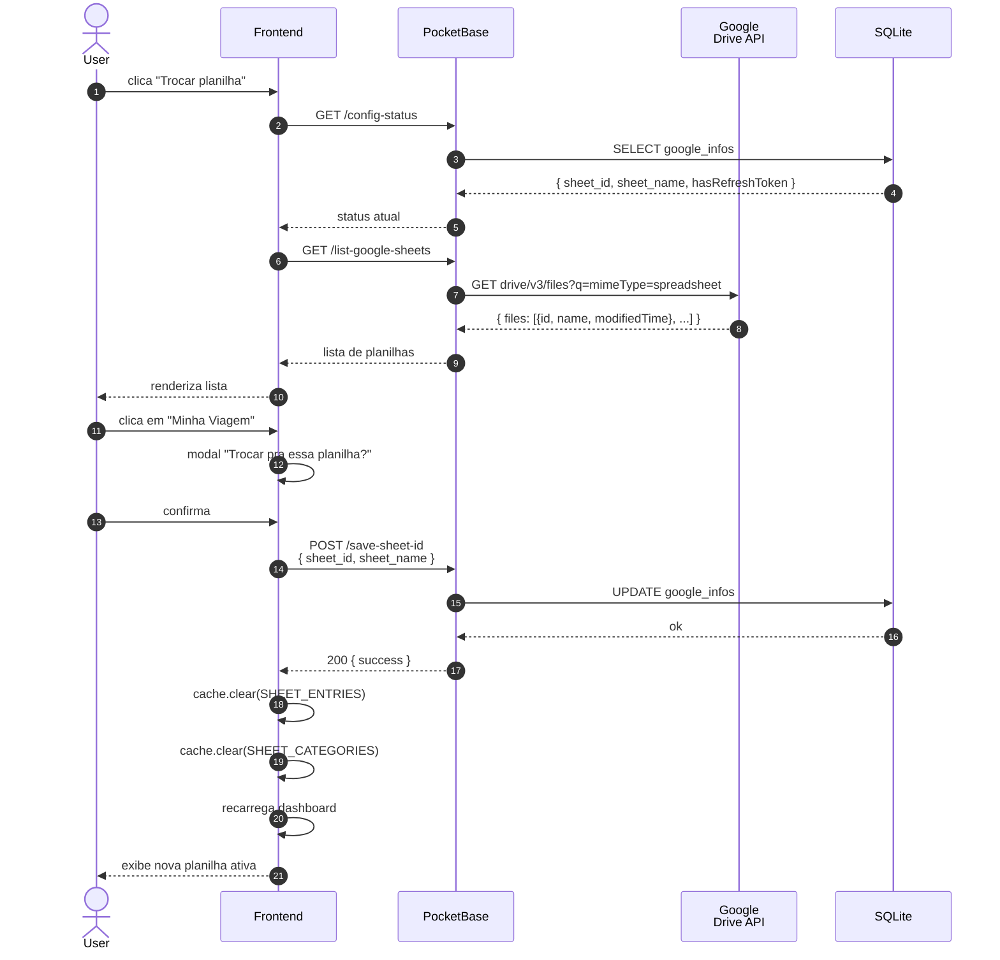
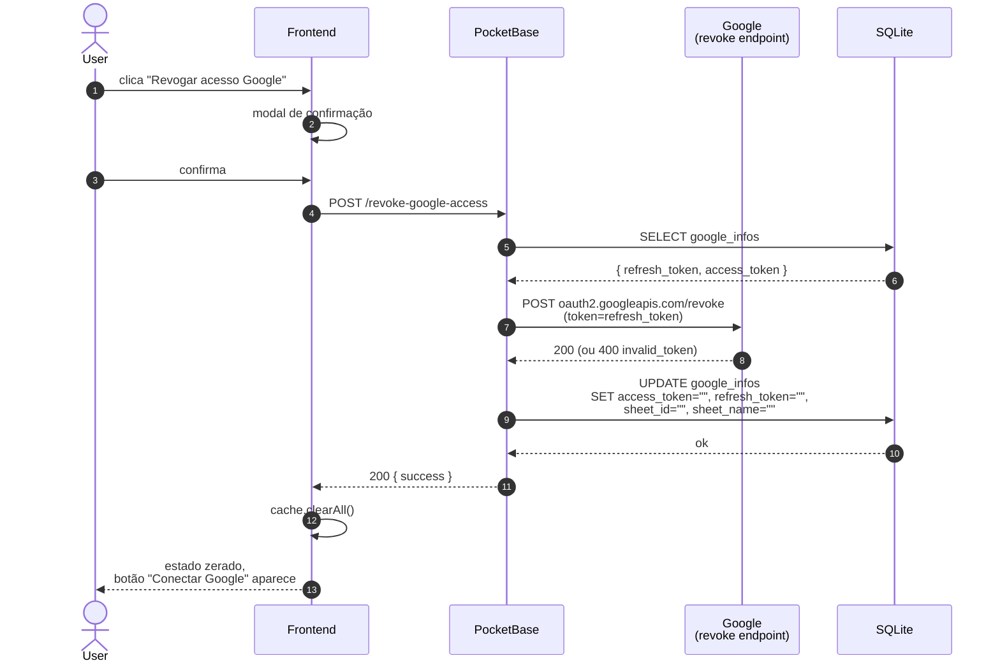

# PRD-009 — Configuração de Planilha

## Contexto

Após a primeira conexão (PRD-002), o user tem uma planilha ativa e
tudo funciona. Mas o user pode precisar:

- Trocar a planilha ativa (se tem várias no Drive)
- Listar planilhas que o app tem acesso
- Desvincular a planilha atual (voltar ao estado "sem planilha")
- Revogar acesso do app ao Google (logout OAuth)

Este PRD cobre essas operações de "gestão da conexão".

## Objetivos

- Mostrar status atual: tem planilha? qual? qual o nome?
- Listar planilhas do Google Drive que o app tem acesso
- Permitir escolher uma planilha diferente (vai substituir `sheet_id`)
- Permitir desvincular (zera `sheet_id` mas mantém tokens)
- Permitir revogar completamente (zera tokens + planilha)
- Mostrar feedback claro de cada ação

## Não-objetivos

- **Criar planilha nova do zero a partir da config** — hoje só é
  possível no fluxo de onboarding (PRD-002). Roadmap: oferecer essa
  opção também aqui (ideia em aberto, caso de uso ainda não está claro).
- **Importar dados** de outra planilha
- **Múltiplas planilhas ativas simultaneamente** — só uma por vez

## Personas

- **Usuário autenticado com Google conectado** — gerencia config

## User Stories

### US-9.1 — Ver configuração atual

**Como** usuário,
** quero** ver qual planilha tá ativa e se minha conexão tá OK,
** para** ter visibilidade do estado.

**Critérios de aceite:**
- [ ] Card mostra: tem planilha? (sim/não), nome, ID (truncado), data
      do último append bem-sucedido (`last_success_append_at`)
- [ ] Card mostra: tokens válidos? (sim/não, baseado em
      `expires_at`)
- [ ] Botão "Trocar planilha" (visível se tem planilha)
- [ ] Botão "Desvincular" (visível se tem planilha)
- [ ] Botão "Revogar acesso Google" (sempre visível)

### US-9.2 — Listar planilhas disponíveis

**Como** usuário,
** quero** ver todas as planilhas do meu Drive que o app pode ver,
** para** escolher qual usar.

**Critérios de aceite:**
- [ ] Lista vem de `GET /list-google-sheets`
- [ ] Query Google: `mimeType='application/vnd.google-apps.spreadsheet' and trashed=false`
- [ ] Ordenar por `modifiedTime desc` (mais recente primeiro)
- [ ] Exibe: nome, modificado em
- [ ] Loading state
- [ ] Empty state: "Nenhuma planilha encontrada no seu Drive.
      Crie uma no Google Sheets ou use o botão 'Criar nova'."

### US-9.3 — Selecionar planilha diferente

**Como** usuário,
** quero** escolher outra planilha da lista,
** para** usar uma que já tenho.

**Critérios de aceite:**
- [ ] Click numa planilha da lista → modal de confirmação
      "Trocar pra [nome]? Lançamentos futuros serão salvos nela.
      A atual fica intacta mas desconectada."
- [ ] Confirma: `POST /save-sheet-id` com novo `sheet_id` + `sheet_name`
- [ ] Hook atualiza `google_infos`
- [ ] Cache invalidado
- [ ] Recarrega dashboard com nova planilha

### US-9.4 — Desvincular planilha atual

**Como** usuário,
** quero** desvincular a planilha atual (sem revogar o Google),
** para** parar de usar sem perder o acesso a Google.

**Critérios de aceite:**
- [ ] Botão "Desvincular" abre confirmação
- [ ] Confirma: `POST /delete-sheet-config` (zera `sheet_id` e
      `sheet_name`, mas mantém tokens)
- [ ] Frontend redireciona pra estado "sem planilha" → mostra botão
      "Criar nova" ou "Selecionar existente"
- [ ] User pode re-vincular depois sem re-autorizar Google

### US-9.5 — Revogar acesso Google

**Como** usuário,
** quero** revogar o acesso do app ao meu Google completamente,
** para** remover toda integração.

**Critérios de aceite:**
- [ ] Botão "Revogar acesso" abre confirmação forte:
      "Isso vai desconectar sua conta Google do app. Você vai precisar
      autorizar de novo pra usar. Continuar?"
- [ ] Confirma: `POST /revoke-google-access`
- [ ] Hook chama `oauth2.googleapis.com/revoke` (revoga refresh_token
      ou access_token — preferir refresh)
- [ ] Hook limpa `access_token`, `refresh_token`, `sheet_id`, `sheet_name`
      no `google_infos`
- [ ] User volta pro estado "tudo zerado" → precisa re-autorizar

## Fluxo de uso

### Trocar planilha
```
User em /dashboard/configuracao.html
  → vê planilha atual: "Planilha Eh Tudo (ID: abc123...)"
  → clica "Trocar planilha"
  → GET /list-google-sheets
  → lista aparece
  → clica em "Minha planilha de Viagem"
  → modal: "Trocar pra 'Minha planilha de Viagem'?"
  → confirma
  → POST /save-sheet-id { sheet_id: "xyz", sheet_name: "Minha planilha de Viagem" }
  → hook atualiza google_infos
  → cache invalidated
  → recarrega dashboard com nova planilha
```

### Revogar
```
User em /dashboard/configuracao.html
  → clica "Revogar acesso Google"
  → modal de confirmação
  → confirma
  → POST /revoke-google-access
  → hook revoga no Google (oauth2.googleapis.com/revoke)
  → hook limpa google_infos (tokens + sheet)
  → frontend: estado "tudo zerado"
  → CTA: "Conectar Google" (re-autoriza)
```

## Diagrama de sequência

### Trocar planilha



### Revogar acesso Google



**Atores:** User, Frontend, PB, Google (Drive API + revoke endpoint), SQLite.

**Highlights:**
- `GET /env-variables` é **público** (sem auth) — expõe só `CLIENT_ID` (não é sensível) e `REDIRECT_URI`. `CLIENT_SECRET` nunca sai do PB
- Revogação **prefere revogar `refresh_token`** quando existe (mais abrangente)
- 400 `invalid_token` no revoke é **tratado como sucesso** (token já estava revogado)
- Após revogar, `cache.clearAll()` limpa tudo — front fica em estado "precisa re-autorizar"

- **Token expirado ao listar planilhas**: hook tenta refresh
  automático. Se refresh falhar, retorna 401 → frontend
  mostra "Reconecte seu Google".
- **Revogação falha no Google** (rede, etc): hook retorna 500.
  Estado local pode estar inconsistente (revogou no Google
  mas tokens ainda locais). Decisão: tentar de novo ou
  instruir user a revogar manualmente em
  https://myaccount.google.com/permissions.
- **Planilha deletada do Drive** (user deletou manualmente):
  `get-sheet-entries` retorna 404. Frontend mostra "Planilha
  não encontrada no Drive. Selecione outra."
- **Múltiplos devices**: device A desvincula, device B continua
  mostrando a planilha. Próxima chamada em B falha 404. OK.
- **User revoga e re-autoriza rapidamente**: o `google_infos`
  pode ter o `sheet_id` antigo. Solução: limpar `sheet_id` na
  re-autorização ou checar no `save-sheet-id` se existe. Roadmap.

## Requisitos técnicos

- Hooks:
  - `google-endpoints.pb.js` (lista, save, current, delete, revoke)
  - `config-status.pb.js` (status agregado)
  - `check-refresh-token.pb.js` (checa refresh_token)
  - `env-variables.pb.js` (CLIENT_ID + REDIRECT_URI público)
- Endpoints:
  - `GET /list-google-sheets`
  - `GET /get-current-sheet`
  - `POST /save-sheet-id`
  - `POST /delete-sheet-config`
  - `POST /revoke-google-access`
  - `GET /config-status`
  - `GET /check-refresh-token`
- Cache: chave `ehtudoplanilha:sheet-entries` é invalidada em
  qualquer mudança de planilha

## Métricas de sucesso

- **% de users que trocam de planilha** — baseline (esperado:
  baixo, maioria usa a padrão)
- **Taxa de erro ao listar** — meta: <2%
- **Taxa de revogação** — quantos users desistem (PRD-002 → PRD-009
  revoke em 30 dias) — meta: <10%
- **Tempo de revogação** — do clique até token limpo (meta: <3s)

## Notas / Pendências

- Hook `env-variables` é público (sem auth) — expõe `CLIENT_ID`
  (que é público mesmo) mas **NÃO** `CLIENT_SECRET`. Documentado
  no código.
- Hook `config-status` é robusto a `google_infos` inexistente
  (retorna `{ hasRefreshToken: false, hasSheetId: false }`).
- **Re-autorização não limpa `sheet_id` antigo** — pode causar
  inconsistência. Roadmap.
- **Sem UI pra "criar planilha nova do zero"** (só no fluxo
  de onboarding). Roadmap: oferecer no config também — **ideia
  em aberto, caso de uso ainda não está claro** mas o user quer
  explorar a feature.
