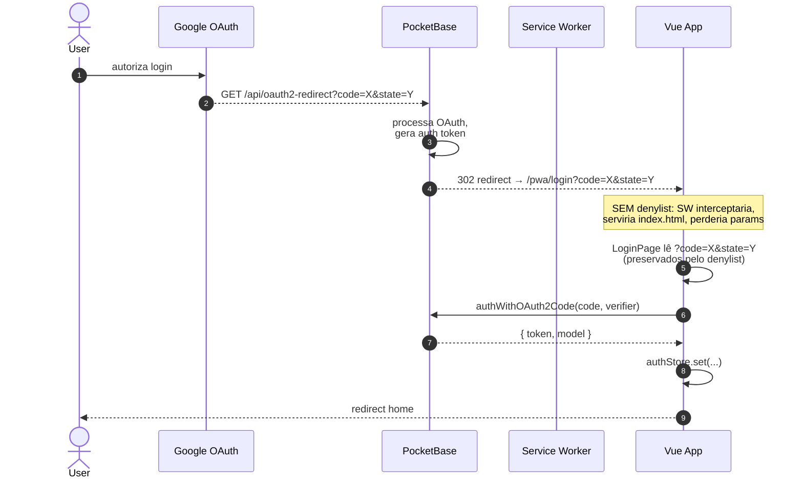

# PRD-010 — PWA: Instalação e Share Target de Imagens

## Contexto

O celular é onde o user **mais registra gastos** (no caixa do
supermercado, no Uber, na padaria). Mas abrir o navegador, digitar
URL, fazer login, achar o form... é fricção.

A solução: **instalar como app** e **compartilhar imagem direto**.
O PWA (Progressive Web App) resolve os dois:

1. **Instalar no celular** — manifest com `display: standalone`
   adiciona o app à home screen, abre sem barra de navegador.
2. **Share Target API** — o PWA aparece na lista de apps pra onde
   o Android/iOS permite "compartilhar" uma imagem. O user tira
   print do comprovante, toca em "Compartilhar", escolhe o app
   Eh Tudo, e a imagem vai direto pro fluxo de OCR (PRD-011).

## Objetivos

- PWA **instalável** no Android e iOS (com limitações do iOS)
- Aparece como **opção de share** pra `image/*` e `application/pdf`
- Recebe a imagem compartilhada via **POST com multipart**
- Service Worker intercepta o POST, guarda no **Cache API**
- Redireciona pro app (`/pwa/?share=true`)
- App lê do cache, exibe preview da imagem, dispara fluxo de OCR
  (PRD-011)

## Não-objetivos

- **Push notifications** — fora (outro PRD futuro)
- **Background sync** — fora
- **Sincronização offline-first** complexa — fora (só leitura do
  cache, não escrita)
- **App nativo** (Play Store / App Store) — roadmap, citado no
  modelo de negócio

## Personas

- **Usuário do celular** — quer registrar gasto rápido

## User Stories

### US-10.1 — Instalar PWA no Android

**Como** usuário Android,
** quero** instalar o app na home screen,
** para** abrir rápido sem navegador.

**Critérios de aceite:**
- [ ] Manifest válido (nome, ícones 192/512, `start_url`, `display: standalone`)
- [ ] HTTPS (pré-requisito do PWA, exceto localhost)
- [ ] Service Worker registrado
- [ ] Browser mostra banner "Adicionar à tela inicial" automaticamente
      (ou user faz manualmente pelo menu)
- [ ] Ícone aparece na home screen com nome "Planilha Eh Tudo"
- [ ] Abre em modo standalone (sem barra de URL)

### US-10.2 — Instalar PWA no iOS

**Como** usuário iOS,
** quero** adicionar à home screen,
** para** abrir rápido.

**Critérios de aceite:**
- [ ] iOS não suporta `beforeinstallprompt` — instrução manual:
      "Toque em Compartilhar → Adicionar à Tela de Início"
- [ ] App abre em modo standalone (com hack de meta tags Apple)
- [ ] Service Worker limitado no iOS (mas funciona pra Share Target)
- [ ] Ícone customizado (não screenshot)

### US-10.3 — Compartilhar imagem (Android)

**Como** usuário com print do comprovante,
** quero** tocar em "Compartilhar" e escolher o app Eh Tudo,
** para** já cair no fluxo de OCR com a imagem pronta.

**Critérios de aceite:**
- [ ] PWA aparece na lista de share targets do Android
- [ ] Aceita: `image/jpeg`, `image/png`, `image/gif`, `image/webp`,
      `application/pdf`
- [ ] POST multipart vai pro `/pwa/`
- [ ] Service Worker intercepta o POST (`event.request.method === 'POST'`)
- [ ] Lê `formData.get('file')` (também `title`, `text`, `url`)
- [ ] Guarda o arquivo no Cache API (`share-target-cache`)
- [ ] Salva metadata em `/pwa/shared-data`
- [ ] Redireciona com 303 pra `/pwa/?share=true`
- [ ] **CRÍTICO**: o SW deve fazer isso e **NÃO** o `NavigationRoute`
      default (que serve `index.html` e perderia os params)
- [ ] **CRÍTICO**: `/pwa/login` está no `denylist` do SW pra OAuth
      não ser interceptado (vide PRD-001)

### US-10.4 — Receber imagem no app

**Como** sistema,
** quero** que a HomePage leia a imagem do cache e exiba preview,
** para** o user revisar antes do OCR.

**Critérios de aceite:**
- [ ] Ao montar HomePage, checa `?share=true` na URL
- [ ] Lê `/pwa/shared-data` do cache (metadata)
- [ ] Lê `/pwa/shared-file-{timestamp}` (arquivo)
- [ ] Exibe preview
- [ ] Botão "Processar" → chama webhook n8n (PRD-011)
- [ ] Botão "Cancelar" → limpa cache do share

### US-10.5 — OAuth callback no PWA

**Como** usuário,
** quero** que o login OAuth funcione dentro do PWA,
** para** não ter que abrir o navegador.

**Critérios de aceite:**
- [ ] `/pwa/login` é o redirect_uri efetivo
- [ ] PB Admin UI configura `/api/oauth2-redirect` como URL externa
- [ ] Google Console tem `https://planilha.ehtudo.app/api/oauth2-redirect`
      (NÃO `/pwa/login` direto)
- [ ] PB nativo cuida do redirect pro `/pwa/login?code=...&state=...`
      via `Settings → Meta → OAuth2`
- [ ] **CRÍTICO**: `/pwa/login` no `denylist` do SW, senão o SW serve
      `index.html` e perde `code`+`state`

## Fluxo de uso

### Install
```
User abre https://planilha.ehtudo.app/pwa/ no Chrome Android
  → vê banner "Adicionar à tela inicial"
  → toca
  → ícone aparece
  → abre em modo standalone
```

### Share
```
User abre galeria, escolhe print de comprovante
  → toca em "Compartilhar"
  → lista de apps aparece
  → "Planilha Eh Tudo" tá lá
  → toca
  → Android faz POST multipart pra /pwa/
  → SW intercepta:
     - lê formData
     - guarda no Cache API
     - retorna Response.redirect('/pwa/?share=true', 303)
  → browser segue o redirect
  → HomePage monta, vê ?share=true
  → lê cache, exibe preview
  → user toca "Processar"
  → PRD-011 (OCR) começa
```

## Diagrama de sequência

```mermaid
sequenceDiagram
    autonumber
    actor U as User
    participant Gal as App de<br/>Galeria
    participant And as Android<br/>(SO)
    participant SW as Service Worker<br/>(pwa/src/sw.js)
    participant Cache as Cache API<br/>(share-target-cache)
    participant V as Vue App<br/>(HomePage.vue)

    Note over U,V: Fase 1 — Compartilhar
    U->>Gal: escolhe print do comprovante
    U->>Gal: toca "Compartilhar"
    Gal-->>And: intent: ACTION_SEND<br/>+ imagem anexada
    And->>And: lista share targets<br/>(do manifest)
    And-->>U: "Planilha Eh Tudo" aparece
    U->>And: seleciona
    And->>SW: POST /pwa/<br/>multipart/form-data<br/>(file: blob)

    Note over SW: SW está vivo mesmo com app fechado!<br/>(onBackgroundFetch equivalente)

    SW->>SW: event.request.method === 'POST'<br/>&& url.pathname === '/pwa/'
    SW->>SW: formData.get('file')<br/>(também title, text, url)
    SW->>Cache: open('share-target-cache')
    SW->>Cache: put('/pwa/shared-file-{ts}',<br/>  Response(blob))
    SW->>Cache: put('/pwa/shared-data',<br/>  Response(JSON{title, text, ts}))
    SW-->>And: 303 redirect → /pwa/?share=true

    Note over And,V: Fase 2 — Browser segue o redirect
    And->>V: GET /pwa/?share=true
    V->>V: router monta HomePage
    V->>V: route.query.share === 'true'
    V->>Cache: match('/pwa/shared-data')
    Cache-->>V: { title, text, ts }
    V->>Cache: match('/pwa/shared-file-{ts}')
    Cache-->>V: blob da imagem
    V-->>U: exibe preview +<br/>botões "Processar" / "Cancelar"

    Note over U,V: Fase 3 — OCR (PRD-011)
    U->>V: toca "Processar"
    V->>N8N: POST webhook n8n<br/>(multipart com imagem)
    N8N-->>V: { cartoes: [{valor, data, ...}] }
    V-->>U: form pré-preenchido
```

### Por que o SW NÃO intercepta o `/pwa/login` (mesmo princípio)



**Atores:** User, App de Galeria, Android, **Service Worker** (pivô!), Cache API, Vue App, opcionalmente n8n (PRD-011), Google OAuth (no 2º diagrama).

**Highlights:**
- O **SW é o pivô** — ele recebe o POST do share ANTES da app Vue. Sem ele, share não funciona
- O SW roda **mesmo com app fechado** (é por isso que o cache persiste)
- 303 redirect força browser a fazer **GET** na URL nova (não reenvia o POST)
- **Denylist `/\/pwa\/login/`** é o que impede o SW de quebrar o OAuth callback
- O OAuth login **não passa pelo SW** porque a URL está no denylist
- O caminho `/pwa/?share=true` é o **mesmo SPA**, mas com query param que o Vue Router detecta

- **Compartilhar múltiplas imagens**: o manifest aceita só 1 file
  por vez (`files[0]`). Pra múltiplas, user compartilha uma por
  vez. Roadmap.
- **Compartilhar sem app aberto**: SW recebe o POST mesmo sem app
  rodando. Cache persiste. User abre depois e vê o preview.
- **PDF**: o manifest inclui `application/pdf` no `accept`. PDF vai
  pro OCR (que precisa saber extrair texto de PDF — pode falhar).
  Roadmap: avisar "PDFs podem ter resultado pior que imagens".
- **Imagem muito grande (>10MB)**: Cache API tem limite (~50MB total
  por origem). Pode falhar. Roadmap: comprimir antes de cachear.
- **iOS share de imagem**: iOS tem suporte limitado a Share Target
  API. PWA no iOS pode não aparecer. Roadmap: instruir user a
  "salvar e depois abrir no app".
- **User cancela share no meio**: cache fica com lixo. Limpar
  periodicamente (ou quando user entra no app sem `?share=true`).
- **OAuth callback com SW ativo**: `denylist: [/\/pwa\/login/]`
  garante que o SW não intercepta. Se esquecido, login quebra
  silenciosamente.

## Requisitos técnicos

- **Manifest** (`pwa/pwa/manifest.webmanifest`):
  - `name`, `short_name`, `description`
  - `start_url: "./"`, `display: "standalone"`, `theme_color`,
    `background_color`
  - `icons: [192, 512, 512 maskable]`
  - **`share_target`** com `action`, `method: POST`, `enctype:
    multipart/form-data`, `params.files` com accepts
- **vite.config.js**:
  - `base: '/pwa/'` (path do app)
  - `VitePWA({ strategies: 'injectManifest', srcDir: 'src',
    filename: 'sw.js', devOptions: { enabled: true, type: 'module' } })`
  - `registerType: 'autoUpdate'`
- **Service Worker** (`pwa/src/sw.js`):
  - `precacheAndRoute(self.__WB_MANIFEST)`
  - `NavigationRoute` com `denylist: [/\/pwa\/login/]`
  - Listener `fetch` pra POST em `/pwa/`
  - Usa Cache API (`share-target-cache`)

## Métricas de sucesso

- **Install rate** — % de users que acessam o PWA e instalam
  (meta: >30% no mobile)
- **Share usage** — % de lançamentos criados via share (vs form manual)
  (meta: >20% em 3 meses)
- **Tempo do share até preview** — meta: <2s
- **Taxa de erro no SW** — % de share que não chega no app
  (meta: <5%)

## Notas / Pendências

- **iOS Share Target** tem suporte limitado (Saiu em 2024 mas
  com bugs). Validar com user real.
- **PDFs** dependem do OCR aceitar PDF — webhook n8n precisa
  saber. Roadmap: validar.
- **Múltiplas imagens** num share — fora do MVP.
- **Background sync** pra offline-first — fora.
- **Push notifications** — fora.
