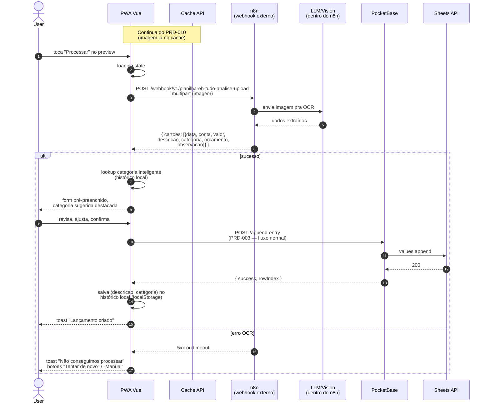

# PRD-011 — OCR de Comprovantes via Webhook n8n

## Contexto

Comprovantes (nota fiscal, print de PIX, extrato, foto de papel)
contêm os dados que o user quer lançar: valor, data, descrição,
categoria provável. **Digitar tudo isso é fricção**.

Solução: o user **tira foto ou printa o comprovante**, compartilha
pro app (PRD-010), e o app **extrai os dados automaticamente** via
OCR + LLM. O user só **confere e confirma**.

Pipeline:
1. Imagem chega no app via Share Target (PRD-010)
2. App envia pro webhook n8n (`VITE_WEBHOOK_URL`)
3. n8n faz OCR (Tesseract / Google Vision / LLM vision)
4. n8n retorna JSON estruturado com os campos
5. App preenche o form de lançamento (PRD-003)
6. User revisa, ajusta categoria se preciso, confirma

## Objetivos

- Extrair: valor, data, descrição, categoria provável
- Retornar JSON com confiança (%) por campo
- Permitir user revisar antes de salvar
- Categorizar com base no histórico do user (categoria mais usada
  pra descrição similar)
- Funcionar com `image/jpeg`, `image/png`, `image/webp`, `application/pdf`

## Não-objetivos

- **OCR de texto genérico** (ex: OCR de documento longo) — fora
- **Extração de dados de recibos em outros idiomas** — fora (PT-BR)
- **Validação contra extrato bancário** — fora
- **Multi-comprovante** (1 imagem com vários recibos) — fora do MVP

## Personas

- **Usuário premium do PWA** (celular) — usa pra registrar rápido

## User Stories

### US-11.1 — Processar imagem compartilhada

**Como** usuário com imagem de comprovante,
** quero** que o app extraia valor, data e descrição automaticamente,
** para** não ter que digitar.

**Critérios de aceite:**
- [ ] Após share, preview aparece (PRD-010)
- [ ] Botão "Processar" envia imagem pro webhook n8n
- [ ] Loading spinner durante processamento (pode demorar 3-10s)
- [ ] Webhook retorna: `{ cartoes: [{ data, conta, valor, descricao,
      categoria, orcamento, observacao }] }`
- [ ] App preenche form de lançamento com os dados extraídos
- [ ] User revisa, ajusta se preciso, confirma (vai pro PRD-003)
- [ ] Toast "Dados extraídos, confira antes de salvar"

### US-11.2 — Categorização inteligente

**Como** usuário,
** quero** que a categoria sugerida seja a que mais uso pra esse tipo
 de gasto,
** para** não ter que escolher manualmente.

**Critérios de aceite:**
- [ ] Sistema analisa histórico: das últimas 20 descrições similares
      (substring match), qual categoria foi mais usada?
- [ ] Sugere a categoria top-1 com confiança
- [ ] User pode sobrescrever (dropdown)
- [ ] Após salvar, a escolha é registrada pro próximo aprendizado

### US-11.3 — Feedback de erro do OCR

**Como** usuário,
** quero** ver um erro claro se o OCR não conseguir extrair nada,
** para** saber que preciso digitar manualmente.

**Critérios de aceite:**
- [ ] Se webhook retorna 5xx ou timeout: toast "Não conseguimos
      processar a imagem. Tente de novo ou digite manualmente."
- [ ] Se webhook retorna sucesso mas sem campos preenchidos: form
      abre vazio, com a imagem anexada (se possível)
- [ ] Botão "Tentar de novo" disponível

### US-11.4 — Histórico de categorias aprendidas

**Como** sistema,
** quero** guardar qual categoria o user escolheu pra cada descrição,
** para** melhorar sugestões futuras.

**Critérios de aceite:**
- [ ] Após salvar, o par (descrição, categoria) é indexado
- [ ] Próxima extração similar sugere baseado nesse histórico
- [ ] Privacidade: histórico fica só no client (localStorage), não
      no servidor
- [ ] User pode limpar histórico

## Fluxo de uso

### Happy path
```
User compartilha imagem (PRD-010)
  → preview aparece
  → toca "Processar"
  → POST webhook n8n com imagem (multipart)
  → loading 3-10s
  → n8n retorna { cartoes: [{ data, conta, valor, descricao,
                              categoria, orcamento, observacao }] }
  → app preenche form
  → user revisa
  → ajusta categoria se quiser
  → confirma
  → POST /append-entry (PRD-003)
  → sucesso
  → aprende par (descricao, categoria) pro histórico
  → toast "Lançamento criado"
```

### OCR falha
```
User compartilha imagem
  → preview aparece
  → toca "Processar"
  → POST webhook → 500 ou timeout
  → toast erro
  → botão "Tentar de novo" / "Digitar manualmente"
  → se "manualmente": form vazio com imagem anexada (referência)
```

## Diagrama de sequência



**Atores:** User, PWA Vue, Cache API, n8n (externo), LLM/Vision (dentro do n8n), PB, Sheets API.

**Highlights:**
- O **LLM não roda no nosso app** — é serviço externo via webhook n8n
- O **histórico de categorias** fica **client-side** (localStorage), não no backend
- O fluxo de "salvar" depois do OCR é o **mesmo** `POST /append-entry` do PRD-003 (reuso!)
- n8n é **infra do próprio user** (mesma VPS do app), não terceiro — dados financeiros não vão pra API pública
- Timeout no webhook: precisa definir (PRD sugere 30s)
- Categorização "inteligente" é **substring match** no histórico — não é ML de verdade

- **Imagem borrada / ilegível**: OCR pode retornar lixo. App deve
  mostrar confiança por campo e pedir confirmação se confiança < 80%.
- **Múltiplos comprovantes numa imagem**: 1ª implementação pode
  processar só 1. Roadmap: multi-recibo.
- **PDF grande**: pode demorar muito. Timeout de 30s no webhook.
- **Webhook n8n offline**: erro 503. Mensagem clara.
- **Descrição vazia**: app sugere "Sem descrição" e permite editar.
- **Data futura**: aceita (pode ser agendamento).
- **Valor zero**: app pede confirmação antes de salvar.
- **Categoria sugerida não existe mais** (deletada): app oferece
  escolher outra ou criar nova.
- **Concorrência**: user processa imagem, abre outro share em
  paralelo. Decisão: processar uma por vez (fila).

## Requisitos técnicos

- **Webhook n8n** externo (não roda no nosso servidor):
  - URL: `https://ehtudo-n8n.pfdgdz.easypanel.host/webhook/v1/planilha-eh-tudo-analise-upload`
  - Input: imagem (multipart) ou base64
  - Output: JSON estruturado
- **Frontend PWA**:
  - `pwa/src/components/UploadArea.vue` (UI de upload)
  - `pwa/src/components/CartaoItem.vue` (preview do cartão extraído)
  - `pwa/src/composables/useAppendEntry.ts` (envia pro webhook + salva)
- **Histórico de categorias**:
  - localStorage, chave `ehtudoplanilha:category-history`
  - Limpar: `CacheService.clearAll()` ou via UI
- **Tipo de retorno** (`pwa/src/types.ts`):
  ```typescript
  interface ProcessImageResponse {
    cartoes: CartaoData[]
    message?: string
    success: boolean
  }
  interface CartaoData {
    data: string         // "23/09/2025 15:02"
    conta: string        // "NU PAGAMENTOS - IP"
    valor: number        // 250
    descricao: string    // "CLINICA FRANCO PEGHINI LTDA"
    categoria: string    // "Outros"
    orcamento: string    // "23/09/2025"
    observacao: string
  }
  ```

## Métricas de sucesso

- **Taxa de acerto do OCR** — % de campos extraídos corretamente
  sem edição do user (meta: >70% em imagens claras)
- **% de lançamentos via OCR** — share/compartilhamento / total
  de lançamentos (meta: >20% em users premium)
- **Tempo médio de processamento** — share até form preenchido
  (meta: <10s)
- **% de uso da sugestão de categoria** — quantas vezes o user
  aceita a categoria sugerida (meta: >60%)
- **Erros do webhook** — meta: <3%

## Notas / Pendências

- Webhook é **externo** (n8n em outro host). Se n8n cair, feature
  quebra. Fallback: digitar manualmente.
- **PDFs** dependem de o n8n saber extrair. Validar.
- **Multi-recibo** (uma foto com 2+ recibos) — fora do MVP.
- **Treinamento de categoria** é client-side (localStorage). Se user
  limpa cache, perde histórico. Roadmap: opcionalmente subir pro
  PocketBase (privado por user).
- **Custo do OCR** é por chamada (n8n consome API de vision). Sem
  rate limit visível ao user. Roadmap: rate limit pra evitar abuse.
- **Premium-only?** Hoje o webhook roda pra todo mundo. Roadmap:
  gating por plano (free tem limite de N/mês, premium ilimitado).
