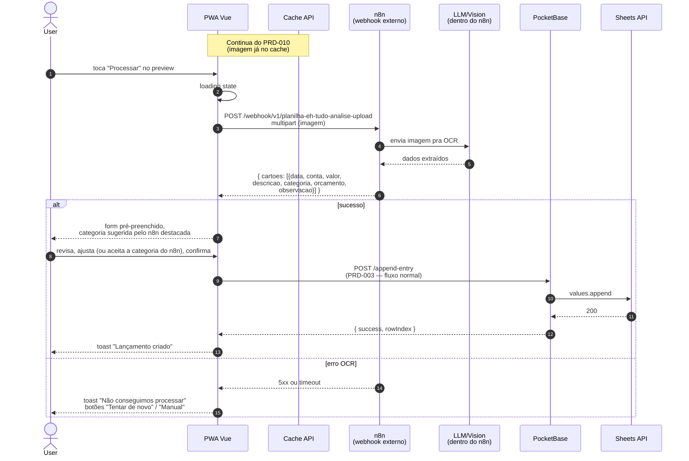

# PRD-011 — OCR de Comprovantes via Webhook n8n

## Contexto

Comprovantes (nota fiscal, print de PIX, extrato, foto de papel)
contêm os dados que o user quer lançar: valor, data, descrição,
categoria provável. **Digitar tudo isso é fricção**.

Solução: o user **tira foto ou printa o comprovante**, compartilha
pro app (PRD-010), e o app **extrai os dados automaticamente** via
OCR + LLM. O user só **confere e confirma**.

Pipeline:
1. Imagem chega no app via Share Target (PRD-010)
2. App envia pro webhook n8n (`VITE_WEBHOOK_URL`)
3. n8n faz OCR (Tesseract / Google Vision / LLM vision)
4. n8n retorna **array de JSONs** com os campos (1 imagem pode
   gerar 1+ lançamentos se for extrato, vários comprovantes, etc)
5. App exibe cada item num modal de revisão
6. **User sempre revisa e confirma** cada item antes de salvar
7. Cada item vira um `POST /append-entry` separado (PRD-003)

## ⚠️ Princípio de segurança

> O **agente n8n NUNCA salva nada direto** na planilha. O retorno
> é sempre um **array JSON** que o user **revisa um por um** (ou
> todos de uma vez) e **confirma explicitamente** antes de cada
> `POST /append-entry`.
>
> Esse mesmo princípio vale pros dois webhooks do app:
> - **OCR** (este PRD) — webhook de upload (`VITE_WEBHOOK_URL`)
> - **Chat** (PRD-012) — webhook de chat (`VITE_WEBHOOK_CHAT`)
>
> A diferença entre os dois é só o input (imagem vs texto natural).
> O contrato de saída é o mesmo: **array de lançamentos pra
> revisar e confirmar**.

## Objetivos

- Extrair: valor, data, descrição, categoria provável
- Retornar JSON com confiança (%) por campo
- Permitir user revisar antes de salvar
- A **categorização** (qual categoria sugerir pra descrição) fica
  por conta do **n8n (backend do webhook)** — não tem lógica disso
  no app. O n8n recebe a imagem, faz OCR, e já retorna uma
  categoria sugerida. O app só exibe o que vier.
- Funcionar com `image/jpeg`, `image/png`, `image/webp`
  (PDF **removido do share target** em 2026-08-08 — vide PRD-010.
  Ideia em aberto: reativar quando OCR souber extrair texto de PDF)

## Não-objetivos

- **OCR de texto genérico** (ex: OCR de documento longo) — fora
- **Extração de dados de recibos em outros idiomas** — fora (PT-BR)
- **Validação contra extrato bancário** — fora
- **Multi-comprovante** (1 imagem com vários recibos) — fora do MVP

## Personas

- **Usuário premium do PWA** (celular) — usa pra registrar rápido

## User Stories

### US-11.1 — Processar imagem compartilhada

**Como** usuário com imagem de comprovante,
** quero** que o app extraia valor, data e descrição automaticamente,
** para** não ter que digitar.

**Critérios de aceite:**
- [ ] Após share, preview aparece (PRD-010)
- [ ] Botão "Processar" envia imagem pro webhook n8n
- [ ] Loading spinner durante processamento (pode demorar 3-10s)
- [ ] Webhook retorna: `{ cartoes: [Lancamento, ...] }` — sempre
      array (pode ter 1+ entradas; 1 imagem pode gerar várias se
      for extrato com vários lançamentos)
- [ ] App exibe cada item num modal de revisão
- [ ] User revisa, ajusta se preciso, confirma **cada item**
- [ ] Cada item vira um `POST /append-entry` separado (PRD-003)
- [ ] Toast "X lançamento(s) extraído(s), confira antes de salvar"

### US-11.2 — Categorização (vinda do n8n)

> **Não tem lógica no app.** A categoria que vem no retorno do
> webhook n8n é só exibida pro user. Não há substring match em
> histórico local, não há aprendizado, não há treinamento.

**Como** usuário,
** quero** ver uma categoria já sugerida pelo OCR,
** para** não ter que escolher manualmente.

**Critérios de aceite:**
- [ ] Webhook n8n retorna o campo `categoria` preenchido
- [ ] App exibe a categoria vinda do n8n como sugestão
- [ ] User pode sobrescrever (dropdown com lista de categorias)
- [ ] User pode digitar uma nova (vai como implícita)

### US-11.3 — Feedback de erro do OCR

**Como** usuário,
** quero** ver um erro claro se o OCR não conseguir extrair nada,
** para** saber que preciso digitar manualmente.

**Critérios de aceite:**
- [ ] Se webhook retorna 5xx ou timeout: toast "Não conseguimos
      processar a imagem. Tente de novo ou digite manualmente."
- [ ] Se webhook retorna sucesso mas sem campos preenchidos: form
      abre vazio, com a imagem anexada (se possível)
- [ ] Botão "Tentar de novo" disponível

### US-11.4 — Histórico de categorias aprendidas

> ⚠️ **NÃO EXISTE** (2026-08-08). O app **não guarda histórico de
> categorias**, não tem aprendizado local, não tem substring match.
> Tudo de "qual categoria sugerir" fica no n8n. Se quiser esse
> comportamento no futuro, vai precisar adicionar (vide Roadmap).

## Fluxo de uso

### Happy path
```
User compartilha imagem (PRD-010)
  → preview aparece
  → toca "Processar"
  → POST webhook n8n com imagem (multipart)
  → loading 3-10s
  → n8n retorna { cartoes: [{ data, conta, valor, descricao,
                              categoria, orcamento, observacao }] }
    (categoria sugerida pelo n8n, sem lógica no app)
  → app preenche form
  → user revisa
  → ajusta categoria se quiser
  → confirma
  → POST /append-entry (PRD-003)
  → sucesso
  → toast "Lançamento criado"
```

### OCR falha
```
User compartilha imagem
  → preview aparece
  → toca "Processar"
  → POST webhook → 500 ou timeout
  → toast erro
  → botão "Tentar de novo" / "Digitar manualmente"
  → se "manualmente": form vazio com imagem anexada (referência)
```

## Diagrama de sequência



**Atores:** User, PWA Vue, Cache API, n8n (externo), LLM/Vision (dentro do n8n), PB, Sheets API.

**Highlights:**
- O **LLM não roda no nosso app** — é serviço externo via webhook n8n
- A **categorização sugerida** vem pronta do n8n — o app só exibe. **Não há**
  histórico local, aprendizado, substring match, ou treinamento no app
- O fluxo de "salvar" depois do OCR é o **mesmo** `POST /append-entry` do PRD-003 (reuso!)
- n8n é **infra do próprio user** (mesma VPS do app), não terceiro — dados financeiros não vão pra API pública
- Timeout no webhook: precisa definir (PRD sugere 30s)
- **Princípio de segurança**: agente NUNCA salva direto. Sempre
  retorna **array JSON** que o user revisa e confirma. Mesmo
  princípio do PRD-012 (chat). Uma imagem pode gerar N
  lançamentos (extrato com várias linhas)

- **Imagem borrada / ilegível**: OCR pode retornar lixo. App deve
  mostrar confiança por campo e pedir confirmação se confiança < 80%.
- **Múltiplos comprovantes numa imagem** (extrato com várias linhas):
  o retorno é um array com N entradas (mesma estrutura do PRD-012
  de lote). User revisa cada um e confirma. App faz N
  `POST /append-entry`.
- **PDF grande**: PDF foi removido do share target (vide PRD-010),
  então hoje não chega. Se voltar no futuro, timeout de 30s.
- **Webhook n8n offline**: erro 503. Mensagem clara.
- **Descrição vazia**: app sugere "Sem descrição" e permite editar.
- **Data futura**: aceita (pode ser agendamento).
- **Valor zero**: app pede confirmação antes de salvar.
- **Categoria sugerida pelo n8n não existe mais** (deletada pelo user):
  app oferece escolher outra ou criar nova.
- **Concorrência**: user processa imagem, abre outro share em
  paralelo. Decisão: processar uma por vez (fila).

## Requisitos técnicos

- **Webhook n8n** externo (não roda no nosso servidor):
  - URL: `https://ehtudo-n8n.pfdgdz.easypanel.host/webhook/v1/planilha-eh-tudo-analise-upload`
  - Input: imagem (multipart) ou base64
  - Output: JSON estruturado (inclui o campo `categoria` já sugerido)
- **Frontend PWA**:
  - `pwa/src/components/UploadArea.vue` (UI de upload)
  - `pwa/src/components/CartaoItem.vue` (preview do cartão extraído)
  - `pwa/src/composables/useAppendEntry.ts` (envia pro webhook + salva)
- **Tipo de retorno** (`pwa/src/types.ts`):
  ```typescript
  interface ProcessImageResponse {
    cartoes: CartaoData[]
    message?: string
    success: boolean
  }
  interface CartaoData {
    data: string         // "23/09/2025 15:02"
    conta: string        // "NU PAGAMENTOS - IP"
    valor: number        // 250
    descricao: string    // "CLINICA FRANCO PEGHINI LTDA"
    categoria: string    // "Outros"
    orcamento: string    // "23/09/2025"
    observacao: string
  }
  ```

## Métricas de sucesso

- **Taxa de acerto do OCR** — % de campos extraídos corretamente
  sem edição do user (meta: >70% em imagens claras)
- **% de lançamentos via OCR** — share/compartilhamento / total
  de lançamentos (meta: >20% em users premium)
- **Tempo médio de processamento** — share até form preenchido
  (meta: <10s)
- **% de uso da sugestão de categoria** — quantas vezes o user
  aceita a categoria sugerida pelo n8n (sem editar) (meta: >60%)
- **Erros do webhook** — meta: <3%

## Notas / Pendências

- Webhook é **externo** (n8n em outro host). Se n8n cair, feature
  quebra. Fallback: digitar manualmente.
- **PDFs** removidos do share target (vide PRD-010). Ideia em aberto.
- **Multi-recibo** (uma foto com 2+ recibos) — fora do MVP.
- **Treinamento de categoria não existe no app.** Toda a lógica de
  "qual categoria sugerir pra descrição similar" fica no n8n.
  Roadmap: se quiser no app, vai precisar adicionar (substring
  match no histórico, salvar no localStorage, etc — não trivial).
- **Custo do OCR** é por chamada (n8n consome API de vision). Sem
  rate limit visível ao user. Roadmap: rate limit pra evitar abuse.
- **Premium-only?** Hoje o webhook roda pra todo mundo. Roadmap:
  gating por plano (free tem limite de N/mês, premium ilimitado).
