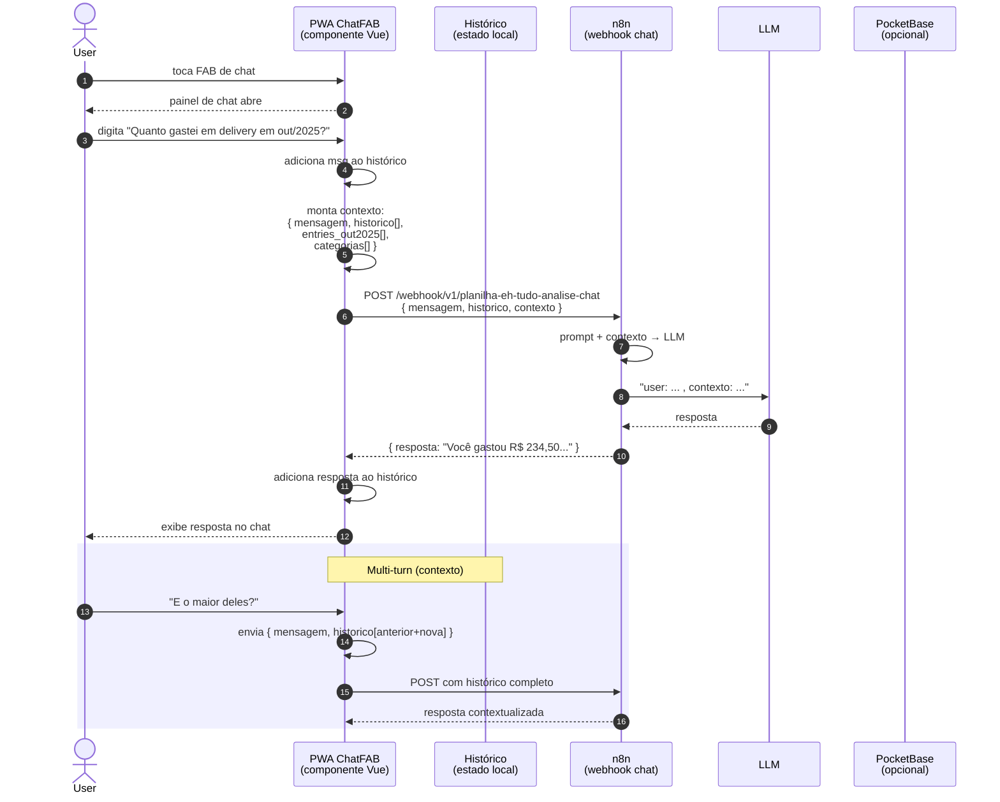

# PRD-012 — Chat com IA (ChatFAB)

## Contexto

Além de lançar (PRD-003) e processar imagem (PRD-011), o user
**pode ter dúvidas** sobre o app ou sobre suas finanças:
- "Quanto gastei em delivery em outubro?"
- "Como eu adiciono uma categoria nova?"
- "Qual a diferença entre lançamento futuro e transferência?"

Solução: um **chat flutuante** no PWA que responde essas perguntas
usando LLM (via webhook n8n). O user clica no FAB (Floating Action
Button), digita, recebe resposta.

Diferente do OCR (que extrai dados de imagem), o chat é **conversa
livre**.

## Objetivos

- Oferecer chat sempre acessível (FAB no canto da tela)
- Responder perguntas sobre os próprios dados do user
- Responder perguntas sobre como usar o app
- Manter contexto da conversa (multi-turn)
- Resposta rápida (<5s típico)

## Não-objetivos

- **Resposta em tempo real com streaming** (SSE) — fora
- **Voz (audio input/output)** — fora
- **Agente que faz ações** (criar lançamento via chat) — fora
  (seria perigoso sem confirmação)
- **Histórico persistente cross-device** — fora (chat é por sessão)

## Personas

- **Usuário autenticado do PWA** — tem dúvida, quer resposta rápida

## User Stories

### US-12.1 — Abrir chat

**Como** usuário,
** quero** tocar num botão flutuante e abrir o chat,
** para** tirar dúvidas sem sair da tela atual.

**Critérios de aceite:**
- [ ] FAB visível em todas as páginas (exceto modal aberto)
- [ ] Cor distinta dos outros FABs (lançar, etc)
- [ ] Ícone de chat (balão)
- [ ] Tocar abre painel de chat
- [ ] Animação suave (slide up)

### US-12.2 — Enviar pergunta

**Como** usuário,
** quero** digitar uma pergunta e receber resposta,
** para** tirar a dúvida.

**Critérios de aceite:**
- [ ] Input de texto no painel
- [ ] Botão de enviar (ou Enter)
- [ ] Mensagem do user aparece no histórico
- [ ] Loading indicator enquanto processa
- [ ] Resposta do assistente aparece
- [ ] Timestamp em cada mensagem

### US-12.3 — Conversa multi-turn

**Como** usuário,
** quero** que o chat lembre das mensagens anteriores,
** para** fazer perguntas de follow-up.

**Critérios de aceite:**
- [ ] Contexto da conversa é enviado junto com cada nova pergunta
- [ ] Histórico visível na tela (scroll up pra ver mais)
- [ ] Limite de contexto: últimas N mensagens (ex: 10)
- [ ] User pode limpar conversa

### US-12.4 — Perguntas sobre dados próprios

**Como** usuário,
** quero** perguntar "quanto gastei em X categoria no mês Y" e
 receber resposta precisa,
** para** não ter que navegar pelo dashboard.

**Critérios de aceite:**
- [ ] Webhook recebe contexto dos dados do user (período selecionado,
      categorias, totais)
- [ ] Resposta é baseada em dados reais, não em chute
- [ ] Se a pergunta for ambígua, chat pede clarificação

### US-12.5 — Perguntas sobre o app

**Como** usuário,
** quero** perguntar "como faço X" e receber instrução,
** para** aprender a usar o app.

**Critérios de aceite:**
- [ ] Webhook recebe contexto sobre features do app
- [ ] Resposta é um passo-a-passo
- [ ] Se a feature não existe, chat diz "isso ainda não tá
      disponível" (não inventa)

## Fluxo de uso

### Conversa simples
```
User toca no FAB de chat
  → painel abre
  → user digita "Quanto gastei em delivery em outubro?"
  → app envia pro webhook n8n: { mensagem, contexto: { entries, mes, ... } }
  → loading
  → webhook responde: "Você gastou R$ 234,50 em Delivery em outubro,
    distribuídos em 8 lançamentos. O maior foi R$ 67 no iFood dia 15."
  → resposta aparece no chat
  → user pode perguntar follow-up
```

### Conversa sobre o app
```
User: "Como eu adiciono uma categoria nova?"
  → webhook responde: "Abre o menu Categorias, clica em +, preenche
    nome e tipo, e salva. A categoria fica disponível nos lançamentos
    imediatamente."
```

## Diagrama de sequência



**Atores:** User, ChatFAB (Vue), Histórico (estado local), n8n (externo), LLM, PB (opcional).

**Highlights:**
- O histórico é **estado local** (memória do componente) — não persiste entre reloads
- O contexto enviado inclui **dados reais do user** (entries, categorias) — o LLM "vê" as finanças
- O **multi-turn** funciona porque o frontend envia o histórico inteiro a cada pergunta
- Privacidade: dados vão pro n8n (que é do próprio user) — não pra API pública de LLM diretamente
- Diferente do OCR (que é stateless), o chat **precisa de contexto** (histórico)
- **Sem streaming** hoje: resposta chega inteira, UX é "tudo ou nada"
- O `resposta` é texto livre (markdown?), não estruturado (PRD não especifica — pode ser limitação)

- **Webhook offline**: chat mostra "Chat temporariamente indisponível.
  Tenta de novo em alguns minutos."
- **Resposta vazia**: "Não entendi. Pode reformular?"
- **Mensagem muito longa**: trunca input em N caracteres
- **Pergunta fora do escopo** (ex: "vai chover amanhã?"): chat
  responde "Sou especializado em finanças e no app. Posso te ajudar
  com outra coisa?"
- **User faz pergunta sobre user errado** (multi-conta): contexto
  sempre do user logado, sem ambiguidade
- **Histórico muito grande**: scroll infinito OU virtual scroll
  (depende de volume)

## Requisitos técnicos

- **Webhook n8n** externo (diferente do OCR):
  - URL: `https://ehtudo-n8n.pfdgdz.easypanel.host/webhook/v1/planilha-eh-tudo-analise-chat`
  - Input: `{ mensagem: string, historico: [...], contexto: { entries,
    categorias, ... } }`
  - Output: `{ resposta: string }`
- **Componente PWA**:
  - `pwa/src/components/ChatFAB.vue` (345 linhas no repo)
  - Estado local (não persistente)
- **Contexto enviado**:
  - Lista de entries do período (compacta)
  - Categorias disponíveis
  - Resumo financeiro (totais)
- **Privacidade**:
  - Dados enviados pro n8n são os do user logado
  - n8n é servidor do user (mesma infra), não terceiro
  - Mas documentar: dados financeiros saem do client pro n8n
- **Performance**:
  - Resposta típica: 2-5s
  - Loading com animação (não travar UI)

## Métricas de sucesso

- **% de users que usam o chat** — baseline (deve ser menor que
  lançamentos, é uso pontual)
- **Mensagens por sessão** — engajamento
- **Taxa de respostas úteis** — survey ou feedback implícito
  ("útil" / "não útil")
- **Tempo médio de resposta** — meta: <5s
- **Erros do webhook** — meta: <3%

## Notas / Pendências

- **Streaming** (resposta aparecendo enquanto é gerada) é roadmap.
  Hoje resposta chega inteira.
- **Multi-idioma** é roadmap (hoje PT-BR).
- **Histórico persistente** é roadmap (cross-session).
- **Agente que age** (cria/edita lançamento via chat) é **perigoso**
  e exige confirmação explícita. Roadmap com cuidado.
- **Rate limit** é roadmap (evitar abuse / custo).
- **Premium-only?** Roadmap: free tem N msgs/mês, premium
  ilimitado. Hoje todo mundo tem acesso.
- **Custo por chamada** (LLM API) é relevante. Roadmap: monitorar.
