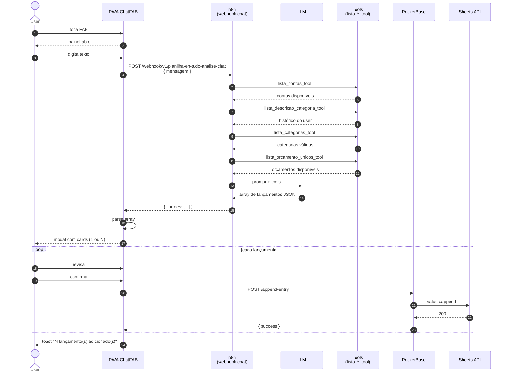

# PRD-012 — Chat: Agente de Lançamentos (ChatFAB)

## Contexto

Além de lançar pelo form (PRD-003) e por imagem (PRD-011), o user
pode **digitar em linguagem natural** o que quer lançar. O chat não
é conversacional (não responde "quanto gastei em X") — é um **agente
que converte texto em array de lançamentos JSON**, pronto pra
revisar e salvar.

O agente tem acesso a 6 ferramentas (tools)
que consultam dados do user em tempo real: histórico de pares
descrição↔categoria, lista de categorias, lista de contas, lista de
orçamentos disponíveis. Com isso ele classifica corretamente cada
lançamento e usa nomenclatura consistente com o que o user já fez.

**Importante:** o chat serve **só pra extrair lançamentos**, não pra
conversar. Insights sobre gastos, perguntas sobre o app, conversa
geral — fora do escopo. Se o user fizer uma pergunta dessas, o agente
provavelmente vai tentar encaixar como lançamento (e o user tem que
dizer "isso não é um lançamento" pra cancelar).

## Objetivos

- Converter **texto em linguagem natural** em array JSON de
  lançamentos estruturados
- Suportar os 3 tipos: **lançamento normal** (data+conta), **futuro**
  (data e conta vazias, com orçamento), **transferência** (2 entradas)
- Suportar **lote** — uma única mensagem com vários lançamentos
  vira array com N entradas
- Consultar ferramentas pra classificar corretamente
  (categoria, conta, orçamento) baseado no histórico do user
- User **sempre revisa e confirma** antes de salvar (não é salvamento
  automático)
- Toast claro: "X lançamentos extraídos, confira antes de salvar"

## Não-objetivos

- **Conversa natural** — o agente não responde "oi", "tudo bem?"
- **Insights sobre gastos** ("quanto gastei em delivery?") — fora
- **Perguntas sobre o app** ("como faço Y?") — fora
- **Resposta em streaming** (SSE) — fora
- **Agente que age** (criar/editar sem confirmação) — **perigoso, sempre exige confirmação**
- **Voz (audio input/output)** — fora
- **Histórico de chat persistente** cross-device — fora (sessão)

## ⚠️ Princípio de segurança

> O agente **NUNCA** salva lançamento automaticamente. O retorno é
> sempre um array JSON que o user **revisa** (modal/form) e
> **confirma explicitamente** antes do `POST /append-entry`.

## Personas

- **Usuário autenticado do PWA** — quer lançar sem abrir form, prefere
  digitar uma frase a tocar 6 campos

## User Stories

### US-12.1 — Lançamento normal via texto

**Como** usuário,
** quero** digitar "gastei 250 na Clinica Pghini ontem" e ver o
 formulário preenchido,
** para** não ter que tocar em 6 campos.

**Critérios de aceite:**
- [ ] User digita texto livre no chat
- [ ] Envia pro webhook n8n (`VITE_WEBHOOK_CHAT`)
- [ ] n8n/LLM classifica como "lançamento normal" (com data e conta)
- [ ] Webhook retorna array JSON:
      ```json
      [{
        "data": "09/12/2025 16:07",
        "conta": "Conta",
        "valor": -250.00,
        "descricao": "Clinica Pghini",
        "categoria": "Médico",
        "orcamento": "31/12/2025",
        "observacao": "Observação útil pra referência futura"
      }]
      ```
- [ ] App exibe modal com campos pré-preenchidos
- [ ] User revisa, ajusta se quiser, confirma
- [ ] Cada vira um `POST /append-entry` (PRD-003)

### US-12.2 — Lançamento futuro via texto

**Como** usuário,
** quero** digitar "salário desse mês 4000" e o agente entender
 que é planejado,
** para** registrar sem data/conta efetivos.

**Critérios de aceite:**
- [ ] User digita texto livre
- [ ] Agente identifica como **lançamento futuro** (vide exemplos do prompt)
- [ ] Webhook retorna:
      ```json
      [{
        "data": "",
        "conta": "",
        "valor": 4000,
        "descricao": "Salario",
        "categoria": "Salário",
        "orcamento": "24/09/2025",
        "observacao": "Salario 4000 mes de setembro"
      }]
      ```
- [ ] App trata como lançamento futuro (data e conta vazias,
      vide PRD-004)

### US-12.3 — Transferência via texto

**Como** usuário,
** quero** digitar "transferi 181 do ITAU pra NUCONTA",
** para** registrar movimento entre contas sem fazer 2 lançamentos
 manuais.

**Critérios de aceite:**
- [ ] Agente identifica como **transferência**
- [ ] Webhook retorna **2 entradas** (negativa na origem, positiva
      no destino):
      ```json
      [
        {
          "data": "10/12/2025 16:07",
          "conta": "ITAU",
          "valor": -181.00,
          "descricao": "Transferência para NUCONTA",
          "categoria": "Transferência",
          "orcamento": "31/12/2025",
          "observacao": "Envio de R$181 para NUCONTA"
        },
        {
          "data": "10/12/2025 16:07",
          "conta": "NUCONTA",
          "valor": 181.00,
          "descricao": "Transferência de ITAU",
          "categoria": "Transferência",
          "orcamento": "31/12/2025",
          "observacao": "Recebido R$181 da conta ITAU"
        }
      ]
      ```
- [ ] Categoria `"Transferência"` é fixa (PRD-005)
- [ ] App trata como transferência (vide PRD-005)

### US-12.4 — Lote de lançamentos

**Como** usuário,
** quero** digitar vários lançamentos numa só mensagem
 (ex: "Salario 4000 mes de dezembro, 56 google youtube desse mês,
 reservar 80 reais para o presente do Arthur"),
** para** lançar várias coisas de uma vez.

**Critérios de aceite:**
- [ ] Agente identifica **múltiplos lançamentos** no mesmo texto
- [ ] Webhook retorna array com **N entradas** (não 1)
- [ ] Pode misturar tipos (ex: 2 futuros + 1 normal)
- [ ] App exibe todos num modal, user revisa um por um (ou todos
      de uma vez) e confirma
- [ ] Cada vira um `POST /append-entry` (ou 2, no caso de transferência)

### US-12.5 — Lote de extrato/CSV colado

**Como** usuário,
** quero** colar um trecho de extrato (ex: linhas CSV
 "2025-12-17,Daiso Brasil Comercio,55.95") e o agente extrair
 cada linha,
** para** não digitar 1 por 1.

**Critérios de aceite:**
- [ ] User cola texto com várias linhas (CSV, print de extrato, etc)
- [ ] Agente identifica cada linha como um lançamento
- [ ] Mesma data pra todos (do extrato) e mesma conta (a que
      user mencionou ou a mais comum)
- [ ] `observacao` contém a linha original como referência futura

## Regras de formatação (do prompt do agente)

| Regra | Detalhe |
|---|---|
| **valor** | Negativo = débito/compra. Positivo = receita/entrada. Se imagem mostra "-", é negativo |
| **data** | Sempre data e hora (`DD/MM/YYYY HH:mm`). Se não tiver hora, usar `{{$now.format('dd/LL/yyyy HH:mm')}}` |
| **observacao** | Mensagem útil pra referência futura (não o texto original do user) |
| **conta** | Usar `lista_contas_tool` (nomenclatura consistente) |
| **categoria** | Priorizar `lista_descricao_categoria_tool` (histórico). Se não achar, usar `lista_categorias_tool` (categoria existente) |
| **orcamento** | Usar `lista_orcamento_unicos_tool` (orçamentos disponíveis), pegar o mais próximo de hoje |

## Ferramentas (tools) do agente

| Tool | Função |
|---|---|
| `lancamento_tool` | Modelo pra despesa/receita com data+conta |
| `lancamento_futuro_tool` | Modelo pra despesa/receita sem data/conta (só orçamento) |
| `transferencia_tool` | Modelo pra 2 lançamentos (origem/destino) |
| `lista_descricao_categoria_tool` | Histórico de pares (descrição, categoria) do user |
| `lista_categorias_tool` | Lista de categorias válidas |
| `lista_contas_tool` | Lista de contas existentes |
| `lista_orcamento_unicos_tool` | Lista de orçamentos disponíveis (pegar o mais próximo) |

## Fluxo de uso

### Happy path (lançamento simples)
```
User no PWA → toca FAB de chat
  → digita "gastei 250 na Clinica Pghini ontem"
  → envia
  → POST webhook n8n /webhook/v1/planilha-eh-tudo-analise-chat
  → n8n/LLM processa:
     - identifica tipo: lançamento normal
     - consulta lista_contas_tool → "Conta"
     - consulta lista_descricao_categoria_tool → "Clinica Pghini" não tem,
       consulta lista_categorias_tool → "Médico"
     - consulta lista_orcamento_unicos_tool → "31/12/2025"
     - monta JSON com data de ontem
  → n8n retorna array JSON com 1 entrada
  → app exibe modal pré-preenchido
  → user revisa, ajusta se quiser
  → confirma
  → POST /append-entry (PRD-003) com 1 entrada
  → toast "Lançamento adicionado"
```

### Lote
```
User: "Salario 4000 mes de dezembro, 56 google youtube desse mês,
       reservar 80 reais para o presente do Arthur"
  → agente identifica 3 lançamentos futuros (data/conta vazias)
  → retorna array com 3 entradas
  → app exibe modal com 3 cards
  → user revisa cada um (ou todos)
  → confirma
  → 3x POST /append-entry
  → toast "3 lançamentos adicionados"
```

### Pergunta fora do escopo
```
User: "quanto gastei em delivery esse mês?"
  → agente tenta encaixar como lançamento (não tem data, não tem valor)
  → provavelmente retorna array vazio ou 1 entrada esquisita
  → app vê array vazio/lixo
  → toast "Não foi possível extrair lançamentos. Use o dashboard
     pra ver resumos."
```

## Diagrama de sequência



**Atores:** User, PWA ChatFAB, n8n (externo), LLM, Tools (consultam dados do user), PB, Sheets API.

**Highlights:**
- O **LLM roda no n8n** (não no app). App só envia texto e recebe array
- Tools consultam **dados reais do user** (não genéricos)
- **Sempre confirmação** antes de salvar (segurança)
- Pode ser 1 ou N lançamentos num único envio
- Tipos suportados: normal, futuro, transferência
- **Perguntas não-lançamento** viram array vazio/lixo (UX ruim, mas o
  user precisa aprender a usar como extração)

## Edge cases

- **Texto ambíguo** ("gastei 50" sem info adicional): agente
  retorna o que conseguir (provavelmente categoria "Outros", conta
  da mais comum). User revisa e ajusta.
- **Texto com data relativa** ("ontem", "semana passada"): agente
  calcula a data. Pode errar.
- **Texto longo / só pergunta** ("oi, quanto gastei?"): agente
  tenta encaixar como lançamento, retorna lixo. UX ruim.
  Roadmap: detectar "não é lançamento" e responder como chat.
- **Conta não existe** (user digitou "XPTO" e não tá na lista):
  agente usa a mais comum ou "Conta". User revisa.
- **Categoria nova** (não tá em `lista_categorias_tool`): agente
  inventa ou usa a mais próxima. User revisa.
- **Orçamento não existe** (descrição do user não bate com nenhum):
  agente usa o mais próximo de hoje. User revisa.
- **Lote grande** (10+ lançamentos): app exibe todos, user revisa
  um por um. Cansativo mas funciona.
- **Erro do n8n** (timeout, 5xx): toast "Chat temporariamente
  indisponível. Tente de novo."
- **Token expirado** (PB nativo): app redireciona pro login (PRD-001)
- **Concorrência**: user processa 2 chats em paralelo. Decisão:
  processar um por vez (fila)

## Requisitos técnicos

- **Webhook n8n** externo (não roda no nosso servidor):
  - URL: `https://ehtudo-n8n.pfdgdz.easypanel.host/webhook/v1/planilha-eh-tudo-analise-chat`
  - Input: `{ mensagem: string }`
  - Output: `{ cartoes: [LancamentoJSON, ...] }` (sempre array)
- **Prompt do agente** (definido no n8n, não no app): o texto
  completo que tu mostrou — define comportamento, ferramentas,
  regras. Mudanças no prompt são feitas no n8n.
- **Ferramentas (tools)**: 6 tools que consultam dados reais do
  user via PB (lista_contas, lista_categorias, etc). Cada tool
  provavelmente é um Code node no n8n que faz uma chamada ao
  PocketBase.
- **Componente PWA**: `pwa/src/components/ChatFAB.vue` (345 linhas)
- **Tipo de retorno** (no prompt):
  ```typescript
  interface LancamentoExtraido {
    data: string         // "09/12/2025 16:07" ou ""
    conta: string        // "" se futuro
    valor: number        // positivo ou negativo
    descricao: string
    categoria: string
    orcamento: string    // "31/12/2025"
    observacao: string
  }
  type ChatResponse = LancamentoExtraido[]  // sempre array
  ```
- **Fluxo de salvar**: pra cada item do array, um `POST /append-entry`
  separado (mesmo do PRD-003)

## Métricas de sucesso

- **Taxa de acerto de extração** — % de lançamentos que o user aceita
  sem editar (meta: >60% em uso normal)
- **% de uso do chat** — % de lançamentos criados via chat (vs form
  manual, vs share) (meta: >15% em 3 meses)
- **% de perguntas fora do escopo** — input que o agente não
  consegue classificar como lançamento (baseline: alto no início,
  meta: <30% à medida que user aprende a usar)
- **Tempo médio de resposta** — do clique "Enviar" até modal
  pré-preenchido (meta: <5s)
- **Erros do webhook** — meta: <3%

## Notas / Pendências

- O **prompt completo do agente** está no n8n (não versionado no
  repo). Pra mudar comportamento do agente, editar lá.
- **Histórico de chat** é só estado local (memória do componente).
  Não persiste entre reloads. Roadmap: persistir.
- **Streaming** (resposta aparecendo enquanto é gerada) é roadmap.
  Hoje resposta chega inteira.
- **Detecção de "não é lançamento"** (pergunta, conversa) é
  roadmap. Hoje agente sempre tenta encaixar como lançamento.
- **Agente que age** (criar/editar sem confirmação) é **perigoso**
  e explicitamente fora do escopo. O user **sempre** revisa.
- **Custo por chamada** (LLM API) é relevante. Roadmap: rate limit
  por user (ex: 50 chamadas/dia free, ilimitado premium).
- **Premium-only?** Roadmap: gating por plano.