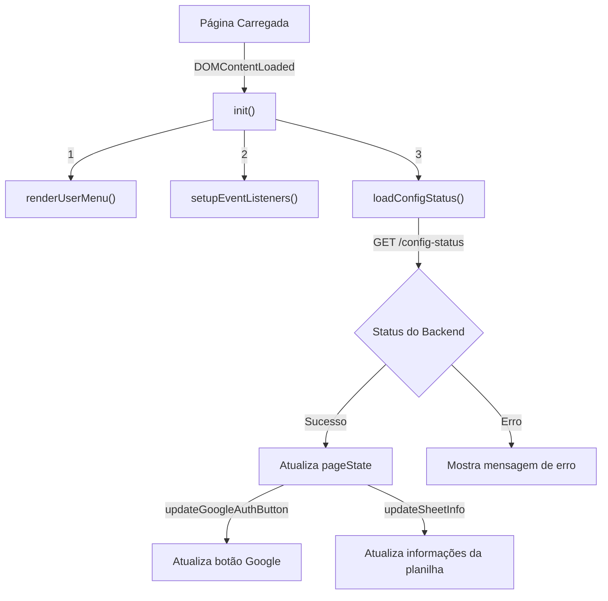
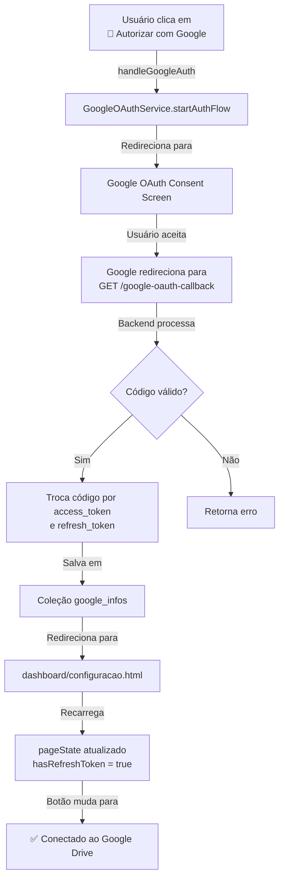
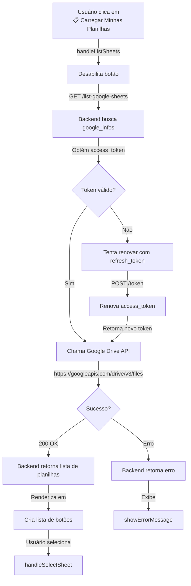
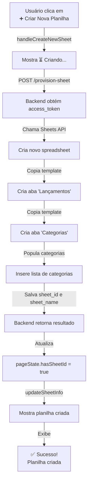
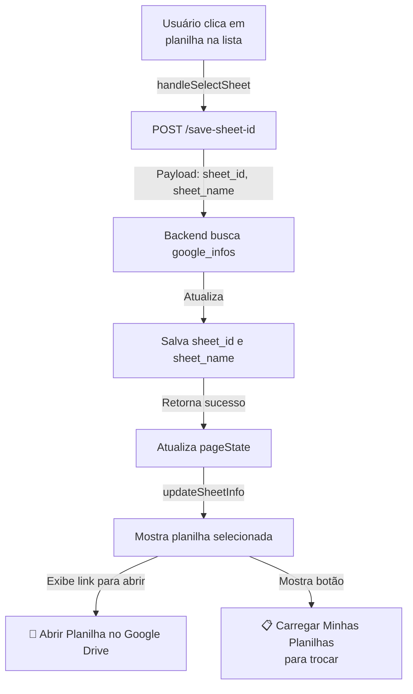
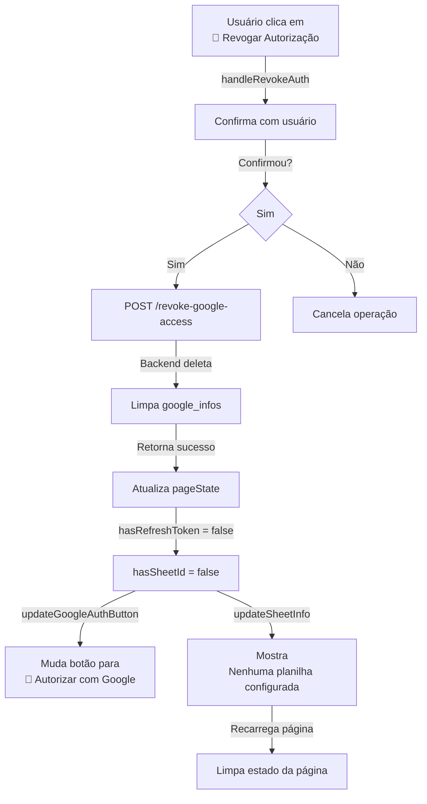

# 📄 Documentação - Página de Configuração (`configuracao.html`)

## 📋 Índice
1. [Visão Geral](#visão-geral)
2. [Arquitetura](#arquitetura)
3. [Fluxos Principais](#fluxos-principais)
4. [Tipos e Interfaces](#tipos-e-interfaces)
5. [Endpoints da API](#endpoints-da-api)
6. [Componentes da UI](#componentes-da-ui)
7. [Estado da Página](#estado-da-página)

---

## 🎯 Visão Geral

A página de configuração (`dashboard/configuracao.html`) é responsável pelo gerenciamento da integração com o Google Drive e pela configuração da planilha de controle financeiro do usuário.

### Funcionalidades Principais:
- ✅ Autorização com Google OAuth
- 📋 Listagem de planilhas do Google Drive
- ➕ Criação de nova planilha a partir de template
- 🔗 Seleção de planilha existente
- 🚫 Revogação de autorização

### Tecnologias:
- **Frontend**: TypeScript + Picnic CSS
- **Backend**: PocketBase com hooks em JavaScript
- **APIs Externas**: Google OAuth 2.0, Google Drive API v3, Google Sheets API v4

---

## 🏗️ Arquitetura

### Estrutura de Camadas

```
┌─────────────────────────────────────────┐
│       UI (configuracao.html)             │
│  - Cartões de autorização e planilha     │
│  - Botões de ação                        │
└────────────────┬────────────────────────┘
                 │
┌─────────────────┴────────────────────────┐
│  Lógica (configuracao.ts)                 │
│  - gerenciamento de estado                │
│  - event listeners                        │
│  - atualização de UI                      │
└────────────────┬────────────────────────┘
                 │
┌─────────────────┴────────────────────────┐
│  Serviços (SheetsService)                 │
│  - Requisições HTTP via PocketBase        │
│  - Transformação de dados                 │
└────────────────┬────────────────────────┘
                 │
┌─────────────────┴────────────────────────┐
│  Backend (PocketBase Hooks)               │
│  - google-endpoints.pb.js                 │
│  - provision-sheet.pb.js                  │
│  - google-oauth-callback.pb.js            │
└────────────────┬────────────────────────┘
                 │
┌─────────────────┴────────────────────────┐
│  APIs Externas                            │
│  - Google OAuth 2.0                       │
│  - Google Drive API v3                    │
│  - Google Sheets API v4                   │
└─────────────────────────────────────────┘
```

### Arquivos Envolvidos

| Arquivo | Responsabilidade |
|---------|------------------|
| `src/dashboard/configuracao.html` | Markup HTML, estrutura dos cartões |
| `src/dashboard/configuracao.ts` | Lógica de página, gerenciamento de estado, event listeners |
| `src/services/sheets.ts` | Serviço de chamadas HTTP para API |
| `pb_hooks/google-endpoints.pb.js` | Endpoints de listagem, salvamento e revogação |
| `pb_hooks/provision-sheet.pb.js` | Endpoint de provisão de nova planilha |
| `pb_hooks/google-oauth-callback.pb.js` | Callback OAuth (login) |

---

## 🔄 Fluxos Principais

### Fluxo 1: Inicialização da Página



**Código:**
```typescript
async function init(): Promise<void> {
  renderUserMenu();
  setupEventListeners();
  await loadConfigStatus();
}

if (document.readyState === 'loading') {
  document.addEventListener('DOMContentLoaded', init);
} else {
  init();
}
```

---

### Fluxo 2: Autorização com Google (OAuth)



**Código:**
```typescript
async function handleGoogleAuth(): Promise<void> {
  const user = pb.authStore.record;
  if (!user?.id) {
    showErrorMessage('Usuário não autenticado.');
    return;
  }
  console.log('🔑 Iniciando fluxo OAuth...');
  await GoogleOAuthService.startAuthFlow(user.id);
}
```

---

### Fluxo 3: Listar Planilhas



**Código:**
```typescript
async function handleListSheets(): Promise<void> {
  if (elements.loadSheetsButton) {
    elements.loadSheetsButton.disabled = true;
    elements.loadSheetsButton.textContent = '⏳ Carregando...';
  }
  
  const sheets = await SheetsService.listGoogleSheets();
  
  sheets.forEach(sheet => {
    const sheetItem = document.createElement('button');
    sheetItem.addEventListener('click', () => 
      handleSelectSheet(sheet.id, sheet.name)
    );
    elements.sheetsList.appendChild(sheetItem);
  });
}
```

---

### Fluxo 4: Criar Nova Planilha



**Código:**
```typescript
async function handleCreateNewSheet(): Promise<void> {
  if (elements.currentSheetDescription) {
    elements.currentSheetDescription.textContent = '⏳ Criando sua planilha...';
  }
  
  const result = await SheetsService.provisionSheet();
  const sheetName = (result as any).sheet_name || 'Planilha Eh Tudo';
  const sheetId = (result as any).sheet_id;
  
  pageState.hasSheetId = true;
  pageState.sheetId = sheetId;
  pageState.sheetName = sheetName;
  
  updateSheetInfo();
  showSuccessMessage(`Planilha "${sheetName}" criada com sucesso!`);
}
```

---

### Fluxo 5: Selecionar Planilha Existente



**Código:**
```typescript
async function handleSelectSheet(sheetId: string, sheetName: string): Promise<void> {
  await SheetsService.saveSheetId(sheetId, sheetName);
  
  pageState.hasSheetId = true;
  pageState.sheetId = sheetId;
  pageState.sheetName = sheetName;
  
  updateSheetInfo();
  showSuccessMessage(`Planilha "${sheetName}" selecionada com sucesso!`);
}
```

---

### Fluxo 6: Revogar Autorização



**Código:**
```typescript
async function handleRevokeAuth(): Promise<void> {
  const confirmed = confirm('Tem certeza que deseja revogar...');
  if (!confirmed) return;
  
  await SheetsService.revokeGoogleAccess();
  
  pageState.hasRefreshToken = false;
  pageState.hasSheetId = false;
  pageState.sheetId = undefined;
  pageState.sheetName = undefined;
  
  updateGoogleAuthButton();
  updateSheetInfo();
  
  showSuccessMessage('Autorização revogada com sucesso!');
  setTimeout(() => { window.location.reload(); }, 3000);
}
```

---

## 📊 Tipos e Interfaces

### PageState
Estado local da página que controla a renderização da UI.

```typescript
interface PageState {
  hasRefreshToken: boolean;      // True se usuário autorizou Google
  hasSheetId: boolean;            // True se tem planilha selecionada
  sheetId?: string;               // ID da planilha no Google Drive
  sheetName?: string;             // Nome da planilha
}
```

**Exemplo:**
```typescript
// Usuário não autorizou Google
let pageState: PageState = {
  hasRefreshToken: false,
  hasSheetId: false,
};

// Após autorização com planilha selecionada
pageState = {
  hasRefreshToken: true,
  hasSheetId: true,
  sheetId: "1a2B3c4D5e6F7g8H9i0J1k2L3m4N5o6P",
  sheetName: "Minhas Finanças 2025"
};
```

### ConfigStatus
Status de configuração retornado pelo backend.

```typescript
interface ConfigStatus {
  hasRefreshToken: boolean;      // Tem refresh token salvo
  hasSheetId: boolean;            // Tem sheet_id configurado
  sheetId?: string;               // ID da planilha
  sheetName?: string;             // Nome da planilha
}
```

**Exemplo:**
```typescript
{
  hasRefreshToken: true,
  hasSheetId: true,
  sheetId: "1a2B3c4D5e6F7g8H9i0J1k2L3m4N5o6P",
  sheetName: "Planilha Eh Tudo"
}
```

### GoogleSheet
Representação de uma planilha do Google Drive.

```typescript
interface GoogleSheet {
  id: string;                     // ID da planilha no Google Drive
  name: string;                   // Nome da planilha
  modifiedTime?: string;          // Data de última modificação (ISO 8601)
  webViewLink?: string;           // Link para visualizar
}
```

**Exemplo:**
```typescript
{
  id: "1a2B3c4D5e6F7g8H9i0J1k2L3m4N5o6P",
  name: "Finanças 2025",
  modifiedTime: "2025-11-03T08:41:42.000Z",
  webViewLink: "https://docs.google.com/spreadsheets/d/1a2B3c4D5e6F7g8H9i0J1k2L3m4N5o6P"
}
```

---

## 🔌 Endpoints da API

### 1. GET `/config-status` - Obter Status de Configuração

**Requisição:**
```http
GET /config-status HTTP/1.1
Host: localhost:8090
Authorization: Bearer {USER_TOKEN}
```

**Resposta Sucesso (200):**
```json
{
  "hasRefreshToken": true,
  "hasSheetId": true,
  "sheetId": "1a2B3c4D5e6F7g8H9i0J1k2L3m4N5o6P",
  "sheetName": "Planilha Eh Tudo"
}
```

**Resposta Erro (401/500):**
```json
{
  "hasRefreshToken": false,
  "hasSheetId": false
}
```

**Implementação Backend:**
```javascript
routerAdd("GET", "/config-status", (c) => {
  const userId = c.auth.id;
  const googleInfo = $app.findFirstRecordByFilter(
    "google_infos",
    "user_id = {:userId}",
    { userId }
  );
  
  return c.json(200, {
    hasRefreshToken: googleInfo.get("refresh_token") ? true : false,
    hasSheetId: googleInfo.get("sheet_id") ? true : false,
    sheetId: googleInfo.get("sheet_id"),
    sheetName: googleInfo.get("sheet_name")
  });
}, $apis.requireAuth());
```

---

### 2. GET `/list-google-sheets` - Listar Planilhas

**Requisição:**
```http
GET /list-google-sheets HTTP/1.1
Host: localhost:8090
Authorization: Bearer {USER_TOKEN}
```

**Resposta Sucesso (200):**
```json
{
  "success": true,
  "sheets": [
    {
      "id": "1a2B3c4D5e6F7g8H9i0J1k2L3m4N5o6P",
      "name": "Finanças 2025",
      "createdTime": "2025-10-15T10:30:00.000Z",
      "modifiedTime": "2025-11-03T08:41:42.000Z"
    },
    {
      "id": "2b3C4d5E6f7G8h9I0j1K2l3M4n5O6p7Q",
      "name": "Orçamento 2025",
      "createdTime": "2025-11-01T14:20:00.000Z",
      "modifiedTime": "2025-11-02T15:30:00.000Z"
    }
  ]
}
```

**Resposta Erro (401):**
```json
{
  "error": "Usuário não autenticado"
}
```

**Resposta Erro (404):**
```json
{
  "error": "Usuário não autorizou acesso ao Google Drive"
}
```

**Resposta Erro (400 - Token Expirado):**
```json
{
  "error": "Falha ao listar planilhas do Google Drive",
  "details": "...",
  "statusCode": 401
}
```

**Fluxo Backend:**
```
1. Valida autenticação (requireAuth)
2. Busca google_infos do usuário
3. Obtém access_token
4. Faz requisição para Google Drive API:
   GET https://www.googleapis.com/drive/v3/files
   ?q=mimeType='application/vnd.google-apps.spreadsheet' and trashed=false
5. Se status 401 (token expirado):
   - Tenta renovar com refresh_token
   - Chama Google OAuth2 token endpoint
   - Salva novo access_token no banco
   - Retry da requisição ao Drive
6. Retorna lista de planilhas
```

---

### 3. POST `/save-sheet-id` - Salvar Planilha Selecionada

**Requisição:**
```http
POST /save-sheet-id HTTP/1.1
Host: localhost:8090
Authorization: Bearer {USER_TOKEN}
Content-Type: application/json

{
  "sheet_id": "1a2B3c4D5e6F7g8H9i0J1k2L3m4N5o6P",
  "sheet_name": "Finanças 2025"
}
```

**Resposta Sucesso (200):**
```json
{
  "success": true,
  "message": "Planilha selecionada com sucesso",
  "sheet_id": "1a2B3c4D5e6F7g8H9i0J1k2L3m4N5o6P",
  "sheet_name": "Finanças 2025"
}
```

**Resposta Erro (400):**
```json
{
  "error": "sheet_id é obrigatório"
}
```

**Resposta Erro (404):**
```json
{
  "error": "Registro Google não encontrado"
}
```

**Implementação Backend:**
```javascript
routerAdd("POST", "/save-sheet-id", (c) => {
  const userId = c.auth.id;
  const data = c.requestInfo().body;
  
  if (!data.sheet_id) {
    return c.json(400, { error: "sheet_id é obrigatório" });
  }
  
  const googleInfo = $app.findFirstRecordByFilter(
    "google_infos",
    "user_id = {:userId}",
    { userId }
  );
  
  googleInfo.set("sheet_id", data.sheet_id);
  googleInfo.set("sheet_name", data.sheet_name || "");
  $app.save(googleInfo);
  
  return c.json(200, {
    success: true,
    message: "Planilha selecionada com sucesso",
    sheet_id: data.sheet_id,
    sheet_name: data.sheet_name
  });
}, $apis.requireAuth());
```

---

### 4. POST `/provision-sheet` - Criar Nova Planilha

**Requisição:**
```http
POST /provision-sheet HTTP/1.1
Host: localhost:8090
Authorization: Bearer {USER_TOKEN}
```

**Resposta Sucesso (200):**
```json
{
  "sheetId": "1a2B3c4D5e6F7g8H9i0J1k2L3m4N5o6P",
  "sheetName": "Planilha Eh Tudo",
  "sheet_id": "1a2B3c4D5e6F7g8H9i0J1k2L3m4N5o6P",
  "sheet_name": "Planilha Eh Tudo"
}
```

**Resposta Erro (400):**
```json
{
  "error": "Erro ao criar planilha",
  "details": "..."
}
```

**Fluxo Backend:**
```
1. Valida autenticação
2. Busca google_infos do usuário
3. Obtém access_token
4. Chama Google Sheets API v4:
   POST https://sheets.googleapis.com/v4/spreadsheets
   - Cria spreadsheet com 2 abas: "Lançamentos" e "Categorias"
5. Popula aba "Categorias" com lista padrão
6. Salva sheet_id e sheet_name no banco
7. Retorna IDs das planilhas criadas
```

**Template de Categorias:**
```javascript
[
  ["Categoria", "Tipo"],           // Header
  ["Salário", "RENDA"],
  ["Aluguel", "PRECISO"],
  ["Supermercado", "PRECISO"],
  ["Delivery", "QUERO"],
  // ... mais categorias
]
```

---

### 5. POST `/revoke-google-access` - Revogar Autorização

**Requisição:**
```http
POST /revoke-google-access HTTP/1.1
Host: localhost:8090
Authorization: Bearer {USER_TOKEN}
```

**Resposta Sucesso (200):**
```json
{
  "success": true,
  "message": "Autorização revogada com sucesso"
}
```

**Resposta Erro (404):**
```json
{
  "error": "Registro Google não encontrado"
}
```

**Implementação Backend:**
```javascript
routerAdd("POST", "/revoke-google-access", (c) => {
  const userId = c.auth.id;
  
  const googleInfo = $app.findFirstRecordByFilter(
    "google_infos",
    "user_id = {:userId}",
    { userId }
  );
  
  // Limpar todos os dados
  googleInfo.set("access_token", "");
  googleInfo.set("refresh_token", "");
  googleInfo.set("sheet_id", "");
  googleInfo.set("sheet_name", "");
  
  $app.save(googleInfo);
  
  return c.json(200, {
    success: true,
    message: "Autorização revogada com sucesso"
  });
}, $apis.requireAuth());
```

---

## 🎨 Componentes da UI

### Cartão 1: Autorização Google Drive

**Estados:**

1. **Não Autorizado:**
```html
<button id="google-auth-button" class="button primary large">
  🔑 Autorizar com Google
</button>
```

2. **Autorizado:**
```html
<button id="google-auth-button" class="button success large" disabled>
  ✅ Conectado ao Google Drive
</button>
<button id="revoke-auth-button" class="button error">
  🚫 Revogar Autorização
</button>
```

---

### Cartão 2: Planilha

**Estado 1: Sem Autorização Google**
```html
<p id="current-sheet-name">Nenhuma planilha configurada</p>
<p id="current-sheet-description">
  Autorize o Google Drive primeiro para gerenciar suas planilhas.
</p>
<!-- Todos os botões ocultos -->
```

**Estado 2: Autorizado, Sem Planilha**
```html
<p id="current-sheet-name">Nenhuma planilha configurada</p>
<p id="current-sheet-description">
  Crie uma nova planilha ou selecione uma existente no seu Google Drive.
</p>
<button id="create-sheet-button" class="button success">
  ➕ Criar Nova Planilha
</button>
<button id="load-sheets-button" class="button">
  📋 Carregar Minhas Planilhas
</button>
```

**Estado 3: Autorizado, Com Planilha**
```html
<p id="current-sheet-name" style="color: #27ae60;">
  Finanças 2025
</p>
<p id="current-sheet-description">
  Sua planilha está pronta para uso. Clique no botão abaixo para abrir no Google Drive...
</p>
<a id="openSheetLink" href="https://docs.google.com/spreadsheets/d/..." target="_blank">
  🔗 Abrir Planilha no Google Drive
</a>
<button id="load-sheets-button" class="button">
  📋 Carregar Minhas Planilhas
</button>
```

---

### Diálogo de Revogação

```javascript
confirm(
  'Tem certeza que deseja revogar a autorização do Google Drive?\n\n' +
  'Isso irá:\n' +
  '• Remover todos os tokens de acesso\n' +
  '• Limpar a configuração da planilha\n' +
  '• Será necessário autorizar novamente para usar o sistema\n\n' +
  'Deseja continuar?'
);
```

---

## 📍 Estado da Página

### Máquina de Estados

```
┌─────────────────────────────────────────────────┐
│ ESTADO: SEM_AUTORIZACAO                          │
│ hasRefreshToken: false                           │
│ hasSheetId: false                                │
├─────────────────────────────────────────────────┤
│ UI:                                              │
│ • Google button: 🔑 Autorizar (habilitado)      │
│ • Revoke button: oculto                          │
│ • Create button: oculto                          │
│ • Load button: oculto                            │
└─────────────────────────────────────────────────┘
         │
         │ [Usuário clica "Autorizar"]
         ↓
┌─────────────────────────────────────────────────┐
│ ESTADO: AUTORIZADO_SEM_PLANILHA                 │
│ hasRefreshToken: true                            │
│ hasSheetId: false                                │
├─────────────────────────────────────────────────┤
│ UI:                                              │
│ • Google button: ✅ Conectado (desabilitado)   │
│ • Revoke button: 🚫 Revogar (visível)          │
│ • Create button: ➕ Criar (visível)            │
│ • Load button: 📋 Carregar (visível)           │
└─────────────────────────────────────────────────┘
         │
         ├─── [Criar Nova] ──→ POST /provision-sheet
         │                           │
         │                           ↓
         │                    ┌─────────────────┐
         │                    │ CRIANDO_PLANILHA│
         │                    └─────────────────┘
         │                           │
         │                           ↓
         │
         ├─── [Carregar] ───→ GET /list-google-sheets
         │                           │
         │                           ↓
         │                    ┌─────────────────┐
         │                    │ LISTANDO_SHEETS │
         │                    │ Renderiza lista │
         │                    └─────────────────┘
         │                           │
         │                [Usuário seleciona]
         │                           │
         │                           ↓
         │
         ↓
┌─────────────────────────────────────────────────┐
│ ESTADO: AUTORIZADO_COM_PLANILHA                 │
│ hasRefreshToken: true                            │
│ hasSheetId: true                                 │
│ sheetId: "1a2B3c4D..."                           │
│ sheetName: "Finanças 2025"                       │
├─────────────────────────────────────────────────┤
│ UI:                                              │
│ • Google button: ✅ Conectado (desabilitado)   │
│ • Revoke button: 🚫 Revogar (visível)          │
│ • Open button: 🔗 Abrir no Drive (visível)     │
│ • Create button: oculto                          │
│ • Load button: 📋 Carregar (visível, trocar)   │
└─────────────────────────────────────────────────┘
         │
         ├─── [Revogar] ──→ POST /revoke-google-access
         │
         ├─── [Abrir] ───→ https://docs.google.com/spreadsheets/d/...
         │
         └─── [Carregar] ──→ Volta para listagem
```

---

## 🔐 Autenticação e Segurança

### Fluxo de Tokens

```
┌──────────────────────────────────────────────┐
│ Google OAuth 2.0 (Code Flow)                  │
├──────────────────────────────────────────────┤
│ 1. Frontend inicia: GoogleOAuthService        │
│    .startAuthFlow()                           │
│                                               │
│ 2. Redireciona para Google:                   │
│    https://accounts.google.com/o/oauth2/      │
│    auth?client_id=...&scope=...               │
│                                               │
│ 3. Usuário faz login e autoriza               │
│                                               │
│ 4. Google redireciona para:                   │
│    GET /google-oauth-callback?code=...        │
│                                               │
│ 5. Backend troca código por tokens:           │
│    POST https://oauth2.googleapis.com/token   │
│    - code                                     │
│    - client_id                                │
│    - client_secret                            │
│                                               │
│ 6. Google retorna:                            │
│    {                                          │
│      "access_token": "...",                   │
│      "refresh_token": "...",                  │
│      "expires_in": 3600,                      │
│      "token_type": "Bearer"                   │
│    }                                          │
│                                               │
│ 7. Backend salva em coleção google_infos      │
│                                               │
│ 8. Redireciona de volta para                  │
│    /dashboard/configuracao.html               │
│                                               │
│ 9. Frontend recarrega e pageState             │
│    é atualizado                               │
└──────────────────────────────────────────────┘
```

### Renovação Automática de Token

Quando um token expira (status 401 do Google Drive API):

```javascript
// Backend detecta 401 no /list-google-sheets
if (driveResponse.statusCode === 401) {
  // Tenta renovar com refresh_token
  const tokenResponse = $http.send({
    url: "https://oauth2.googleapis.com/token",
    method: "POST",
    body: {
      refresh_token: googleInfo.refresh_token,
      client_id: GOOGLE_CLIENT_ID,
      client_secret: GOOGLE_CLIENT_SECRET,
      grant_type: "refresh_token"
    }
  });
  
  // Se sucesso (200)
  // - Salva novo access_token no banco
  // - Retry da requisição ao Google Drive
}
```

---

## 🐛 Tratamento de Erros

### Matriz de Erros Possíveis

| Erro | Código | Causa | Ação do Usuário |
|------|--------|-------|-----------------|
| Usuário não autenticado | 401 | Sessão PocketBase expirada | Login novamente |
| Sem autorização Google | 404 | Registro google_infos não existe | Clicar "Autorizar" |
| Token expirado | 401 (do Google) | Access token expirado | Renovação automática |
| Refresh token inválido | 400 | Refresh token foi revogado | Revogar e autorizar novamente |
| Falha na API do Google | 500+ | Problema no servidor Google | Tentar novamente mais tarde |
| Erro de rede | Timeout | Conexão cortada | Verificar internet |

### Exemplos de Tratamento

**No Frontend:**
```typescript
try {
  const sheets = await SheetsService.listGoogleSheets();
} catch (error: any) {
  if (error?.status === 401) {
    showErrorMessage('Token de acesso expirado. Tente revogar e autorizar novamente.');
  } else if (error?.status === 404) {
    showErrorMessage('Autorização com Google Drive não encontrada. Autorize primeiro.');
  } else if (error?.status === 400) {
    showErrorMessage('Falha ao acessar Google Drive. Verifique suas permissões.');
  } else {
    showErrorMessage('Erro ao listar planilhas. Tente novamente.');
  }
}
```

**No Backend:**
```javascript
console.log("🚀 Endpoint /list-google-sheets chamado");
console.log("👤 User ID:", userId);
console.log("✅ Registro google_infos encontrado:", googleInfo.id);
console.log("📊 Status da resposta do Google Drive:", driveResponse.statusCode);
console.log("✅ Planilhas listadas com sucesso");
```

---

## 📚 Exemplo Completo de Uso

```typescript
// 1. Página carrega
// → init() → loadConfigStatus()
// → Backend: GET /config-status
// → pageState atualizado

// 2. Usuário clica "Autorizar"
// → handleGoogleAuth()
// → Redireciona para Google OAuth
// → Usuário faz login
// → Google redireciona para /google-oauth-callback?code=...
// → Backend: Troca código por tokens
// → Redireciona de volta
// → Página recarrega, pageState atualizado

// 3. Usuário clica "Carregar Minhas Planilhas"
// → handleListSheets()
// → Backend: GET /list-google-sheets
// → Backend: Chama Google Drive API
// → Backend: Renova token se necessário
// → Frontend: Renderiza lista de planilhas

// 4. Usuário clica em uma planilha
// → handleSelectSheet(sheetId, sheetName)
// → Backend: POST /save-sheet-id
// → Backend: Salva sheet_id e sheet_name
// → pageState atualizado
// → UI mostra planilha selecionada

// 5. Usuário pode agora:
// → Abrir no Google Drive (link direto)
// → Trocar de planilha
// → Revogar autorização
```

---

## 🔗 Referências

- [Google OAuth 2.0 Documentation](https://developers.google.com/identity/protocols/oauth2)
- [Google Drive API v3](https://developers.google.com/drive/api/v3/about-sdk)
- [Google Sheets API v4](https://developers.google.com/sheets/api)
- [PocketBase Documentation](https://pocketbase.io)

---

**Versão:** 1.0  
**Última atualização:** 03 de Novembro de 2025  
**Autores:** GitHub Copilot, Edson Candido
